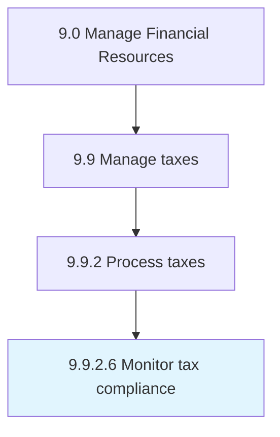

# Monitor tax compliance

> Checking and correcting the tax policies according to the rules and regulations set by the organization.

## Overview

Activity 9.9.2.6 is an activity within the Manage Financial Resources framework. 

Checking and correcting the tax policies according to the rules and regulations set by the organization.

## Process Hierarchy



## Key Statistics

| Metric | Value |
|--------|-------|
| APQC Code | 10935 |
| Hierarchy ID | 9.9.2.6 |
| Level | Activity |
| Parent | [9.9.2](../) |
| Sub-Processes | 0 |


## GraphDL Semantic Structure

```
monitor.TaxCompliance
```

| Component | Value | Description |
|-----------|-------|-------------|
| Verb | `monitor` | Primary action |
| Object | `tax compliance` | Direct object |


## Related Concepts

- TaxCompliance


---

*Source: APQC PCF 10935 (9.9.2.6) - APQC*
