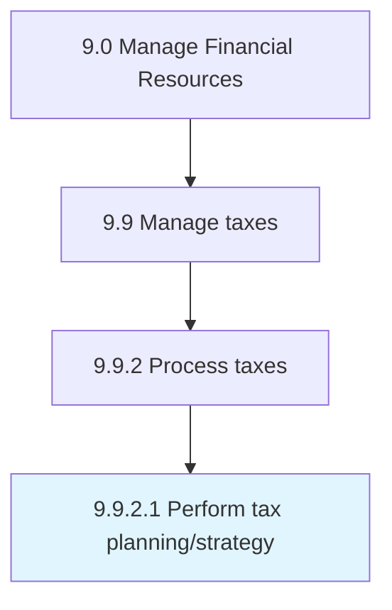

# Perform tax planning/strategy

> Creating and implementing strategies for taxes to be paid or collected by the business.

## Overview

Activity 9.9.2.1 is an activity within the Manage Financial Resources framework. 

Creating and implementing strategies for taxes to be paid or collected by the business.

## Process Hierarchy



## Key Statistics

| Metric | Value |
|--------|-------|
| APQC Code | 10930 |
| Hierarchy ID | 9.9.2.1 |
| Level | Activity |
| Parent | [9.9.2](../) |
| Sub-Processes | 0 |


## GraphDL Semantic Structure

```
perform.TaxPlanningstrategy
```

| Component | Value | Description |
|-----------|-------|-------------|
| Verb | `perform` | Primary action |
| Object | `tax planning/strategy` | Direct object |


## Related Concepts

- TaxPlanning
- TaxStrategy


---

*Source: APQC PCF 10930 (9.9.2.1) - APQC*
