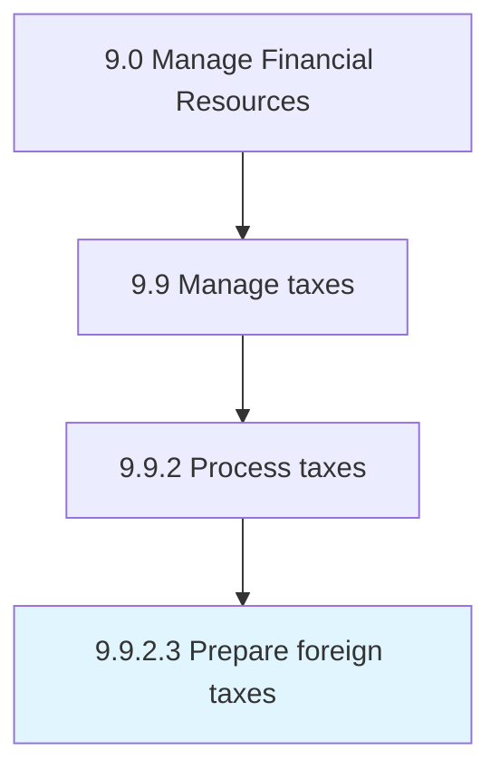

# Prepare foreign taxes

> Preparing reports about paid or accrued foreign taxes to an overseas country.

## Overview

Activity 9.9.2.3 is an activity within the Manage Financial Resources framework. 

Preparing reports about paid or accrued foreign taxes to an overseas country.

## Process Hierarchy



## Key Statistics

| Metric | Value |
|--------|-------|
| APQC Code | 10932 |
| Hierarchy ID | 9.9.2.3 |
| Level | Activity |
| Parent | [9.9.2](../) |
| Sub-Processes | 0 |


## GraphDL Semantic Structure

```
prepare.ForeignTaxes
```

| Component | Value | Description |
|-----------|-------|-------------|
| Verb | `prepare` | Primary action |
| Object | `foreign taxes` | Direct object |


## Related Concepts

- [ForeignTaxes](/concepts/ForeignTaxes)


---

*Source: APQC PCF 10932 (9.9.2.3) - APQC*
