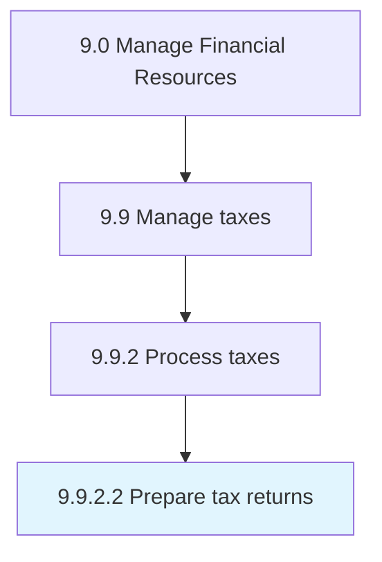

# Prepare tax returns

> Preparing and submitting tax reports for every employee to the tax department in order to show the tax paid and deducted from their salaries in the year.

## Overview

Activity 9.9.2.2 is an activity within the Manage Financial Resources framework. 

Preparing and submitting tax reports for every employee to the tax department in order to show the tax paid and deducted from their salaries in the year.

## Process Hierarchy



## Key Statistics

| Metric | Value |
|--------|-------|
| APQC Code | 10931 |
| Hierarchy ID | 9.9.2.2 |
| Level | Activity |
| Parent | [9.9.2](../) |
| Sub-Processes | 0 |


## GraphDL Semantic Structure

```
prepare.TaxReturns
```

| Component | Value | Description |
|-----------|-------|-------------|
| Verb | `prepare` | Primary action |
| Object | `tax returns` | Direct object |


## Related Concepts

- [TaxReturns](/concepts/TaxReturns)


---

*Source: APQC PCF 10931 (9.9.2.2) - APQC*
