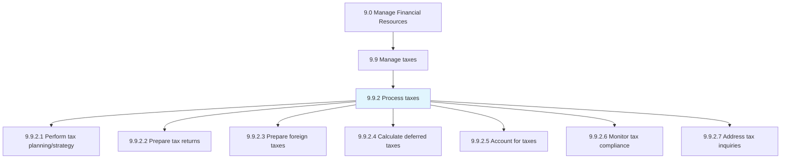
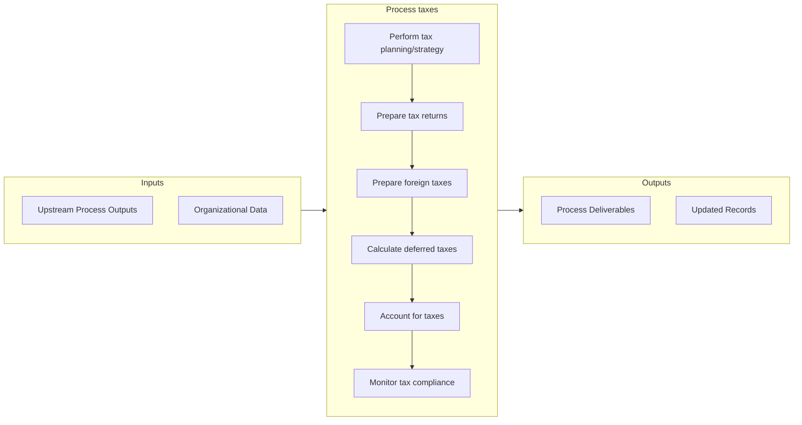

# Process taxes

> Processing the taxes of the organization in line with the regional taxation structure, including corporate, property, excise, and service taxes.

## Overview

Process 9.9.2 is a core process that defines the specific procedures for process taxes. 

Processing the taxes of the organization in line with the regional taxation structure, including corporate, property, excise, and service taxes.

## Process Hierarchy



## Key Statistics

| Metric | Value |
|--------|-------|
| APQC Code | 10766 |
| Hierarchy ID | 9.9.2 |
| Level | Process |
| Parent | [9.9](../) |
| Sub-Processes | 7 |


## GraphDL Semantic Structure

```
process.Taxes
```

| Component | Value | Description |
|-----------|-------|-------------|
| Verb | `process` | Primary action |
| Object | `taxes` | Direct object |


## Process Flow



## Sub-Processes

| Process | Hierarchy ID | Description |
|---------|-------------|-------------|
| [Perform tax planning/strategy](./PerformTaxPlanningstrategy) | 9.9.2.1 | Creating and implementing strategies for taxes to be paid or collected by the business |
| [Prepare tax returns](./PrepareTaxReturns) | 9.9.2.2 | Preparing and submitting tax reports for every employee to the tax department in order to show the t |
| [Prepare foreign taxes](./PrepareForeignTaxes) | 9.9.2.3 | Preparing reports about paid or accrued foreign taxes to an overseas country |
| [Calculate deferred taxes](./CalculateDeferredTaxes) | 9.9.2.4 | Calculating the income that has been realized when the tax on that income has not |
| [Account for taxes](./AccountForTaxes) | 9.9.2.5 | Managing the organization's financial accounts for the purpose of taxation |
| [Monitor tax compliance](./MonitorTaxCompliance) | 9.9.2.6 | Checking and correcting the tax policies according to the rules and regulations set by the organizat |
| [Address tax inquiries](./AddressTaxInquiries) | 9.9.2.7 | Addressing any tax queries by any regulatory or government authorities |


## Related Concepts

- [Taxes](/concepts/Taxes)


---

*Source: APQC PCF 10766 (9.9.2) - APQC*
