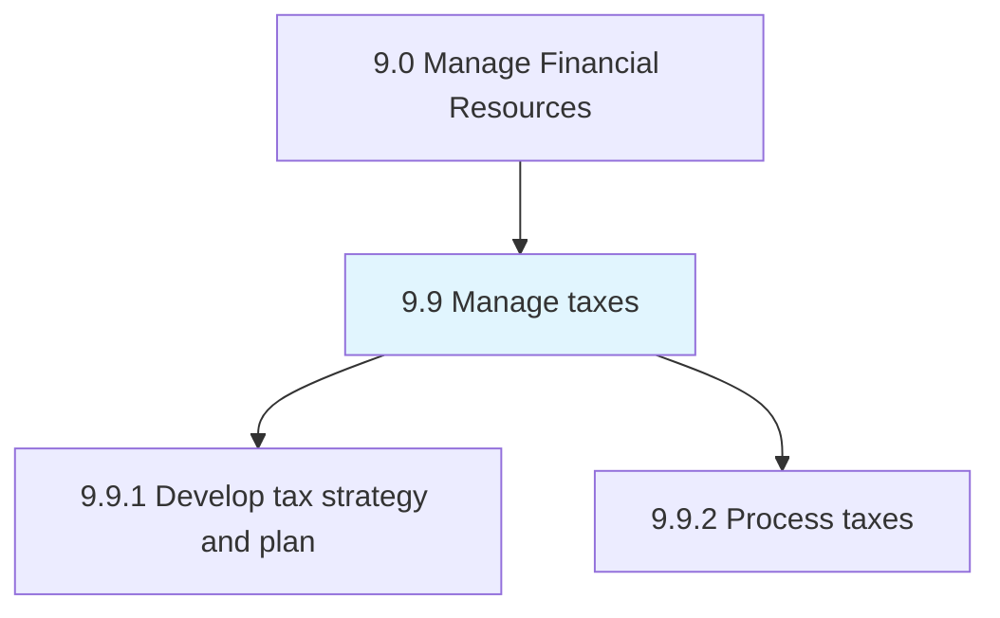
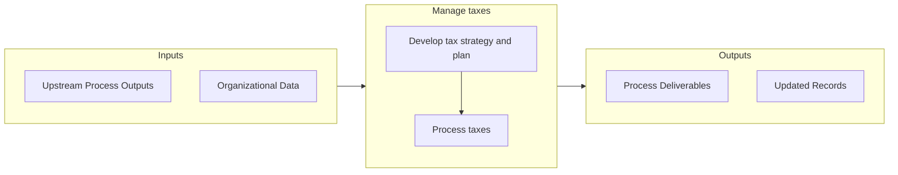

# Manage taxes

> Estimating the organization's periodic tax liabilities.

## Overview

Group 9.9 is a process group within APQC Category 9.0 (Manage Financial Resources). 

Estimating the organization's periodic tax liabilities. Ensure that appropriate taxing authorities receive tax return filings and payments when due.

## Process Hierarchy



## Key Statistics

| Metric | Value |
|--------|-------|
| APQC Code | 10736 |
| Hierarchy ID | 9.9 |
| Level | Group |
| Parent | [9](../) |
| Sub-Processes | 2 |


## GraphDL Semantic Structure

```
manage.Taxes
```

| Component | Value | Description |
|-----------|-------|-------------|
| Verb | `manage` | Primary action |
| Object | `taxes` | Direct object |


## Process Flow



## Sub-Processes

| Process | Hierarchy ID | Description |
|---------|-------------|-------------|
| [Develop tax strategy and plan](./9.9.1-DevelopTaxStrategyPlan/) | 9.9.1 | Setting targets for periodic tax liabilities |
| [Process taxes](./9.9.2-ProcessTaxes/) | 9.9.2 | Processing the taxes of the organization in line with the regional taxation structure, including cor |


## Related Concepts

- [Taxes](/concepts/Taxes)


---

*Source: APQC PCF 10736 (9.9) - APQC*
