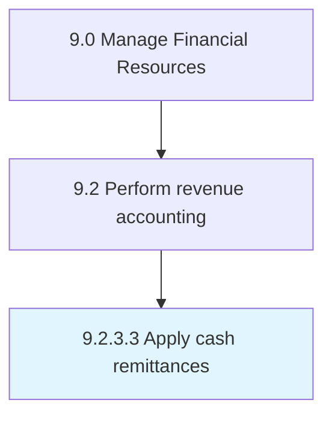

# Apply cash remittances

> Checking and moving funds between countries for business activities, typically through authorized remittance agents.

## Overview

Activity 9.2.3.3 is an activity within the Manage Financial Resources framework. 

Checking and moving funds between countries for business activities, typically through authorized remittance agents.

## Process Hierarchy



## Key Statistics

| Metric | Value |
|--------|-------|
| APQC Code | 10801 |
| Hierarchy ID | 9.2.3.3 |
| Level | Activity |
| Parent | [9.2.3](../) |
| Sub-Processes | 0 |


## GraphDL Semantic Structure

```
apply.CashRemittances
```

| Component | Value | Description |
|-----------|-------|-------------|
| Verb | `apply` | Primary action |
| Object | `cash remittances` | Direct object |


## Related Concepts

- CashRemittances


---

*Source: APQC PCF 10801 (9.2.3.3) - APQC*
