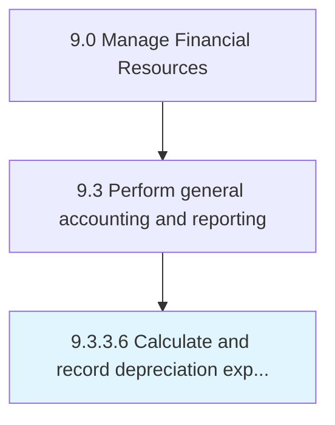

# Calculate and record depreciation expense

> Carrying out accounting for depreciation over fixed assets.

## Overview

Activity 9.3.3.6 is an activity within the Manage Financial Resources framework. 

Carrying out accounting for depreciation over fixed assets. Compute the sums necessitated. Maintain a record of the cost value of fixed assets over their useful life in the book of accounts.

## Process Hierarchy



## Key Statistics

| Metric | Value |
|--------|-------|
| APQC Code | 10833 |
| Hierarchy ID | 9.3.3.6 |
| Level | Activity |
| Parent | [9.3.3](../) |
| Sub-Processes | 0 |


## GraphDL Semantic Structure

```
calculate.AndRecordDepreciationExpense
```

| Component | Value | Description |
|-----------|-------|-------------|
| Verb | `calculate` | Primary action |
| Object | `and record depreciation expense` | Direct object |


## Related Concepts

- DepreciationExpense
- DepreciationExpense


---

*Source: APQC PCF 10833 (9.3.3.6) - APQC*
