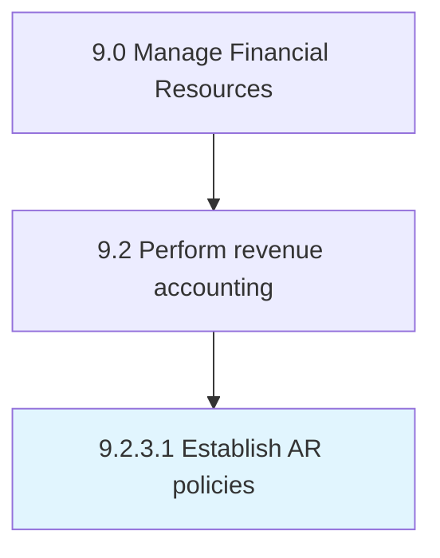

# Establish AR policies

> Creating rules and regulations to be followed in case of credit sales to customers.

## Overview

Activity 9.2.3.1 is an activity within the Manage Financial Resources framework. 

Creating rules and regulations to be followed in case of credit sales to customers. Create rules and procedures to follow at the time of sale (e.g., the allowable number of installments).

## Process Hierarchy



## Key Statistics

| Metric | Value |
|--------|-------|
| APQC Code | 10799 |
| Hierarchy ID | 9.2.3.1 |
| Level | Activity |
| Parent | [9.2.3](../) |
| Sub-Processes | 0 |


## GraphDL Semantic Structure

```
establish.ARPolicies
```

| Component | Value | Description |
|-----------|-------|-------------|
| Verb | `establish` | Primary action |
| Object | `AR policies` | Direct object |


## Related Concepts

- [ARPolicies](/concepts/ARPolicies)


---

*Source: APQC PCF 10799 (9.2.3.1) - APQC*
