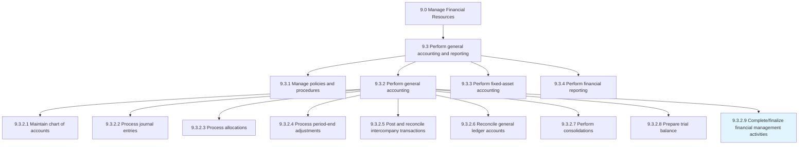
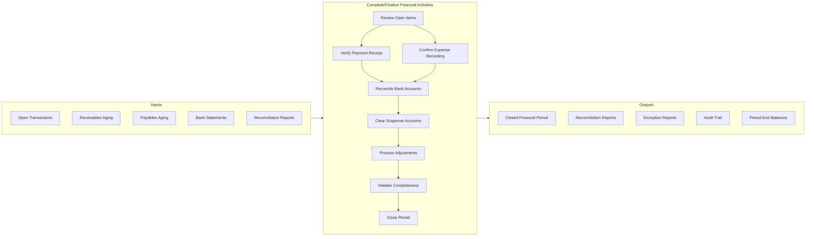
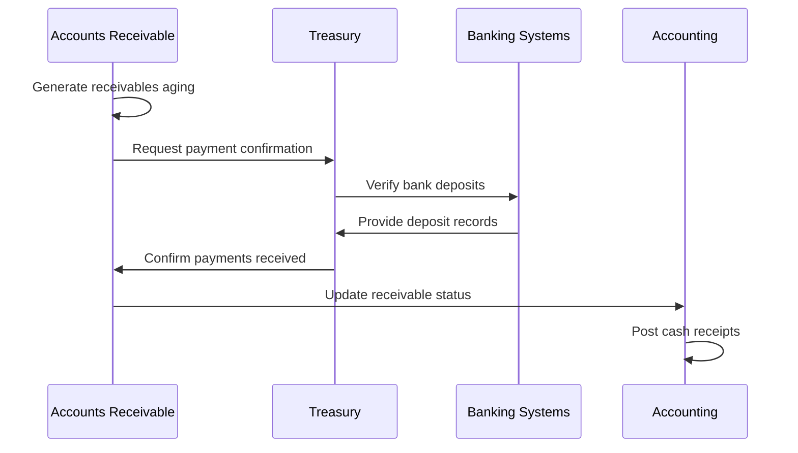
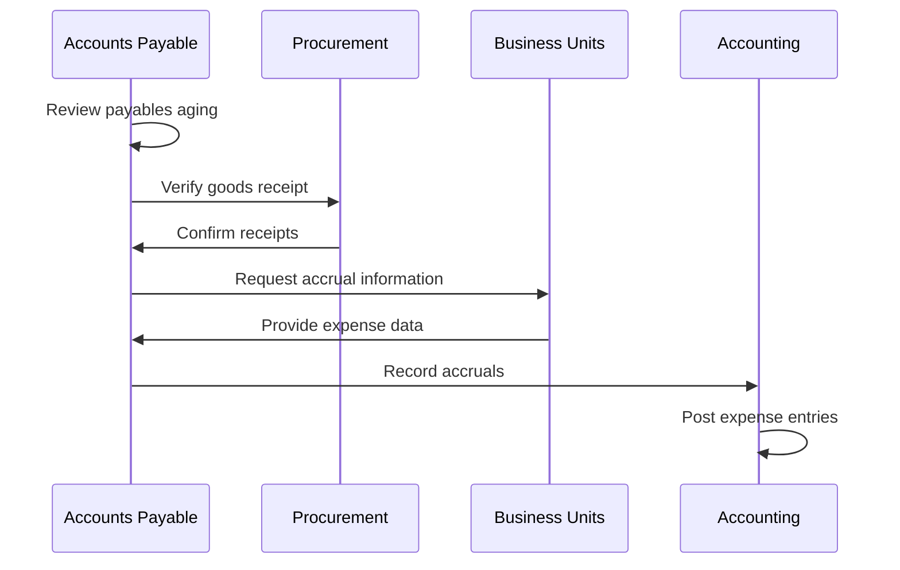
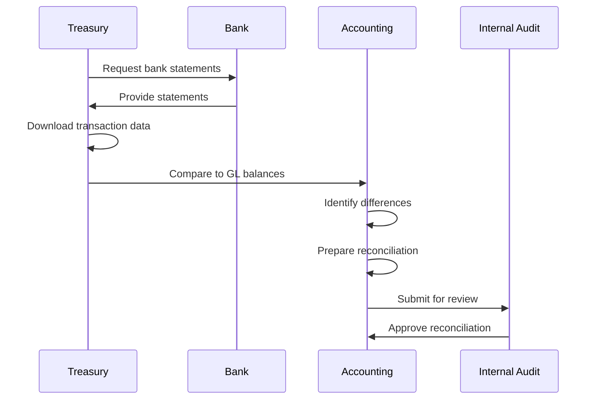
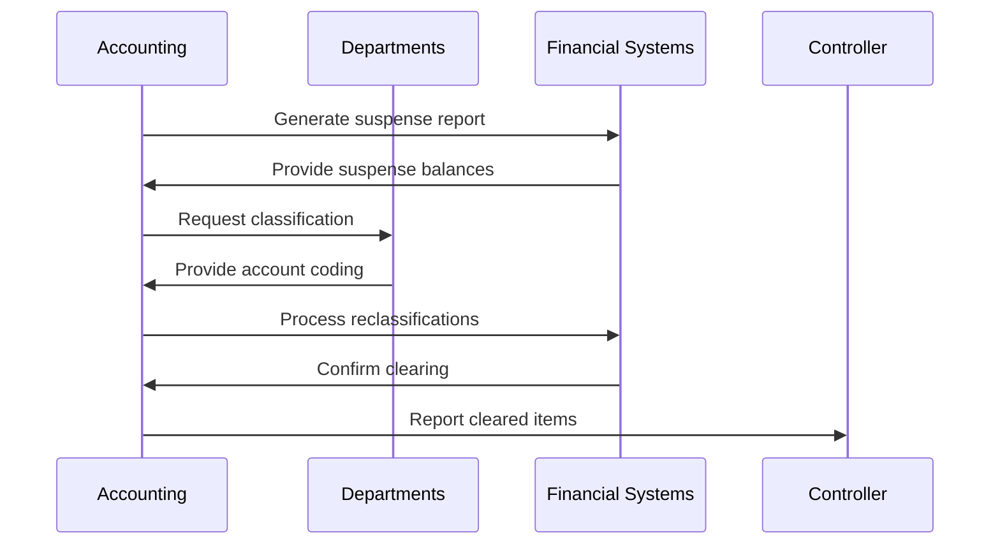
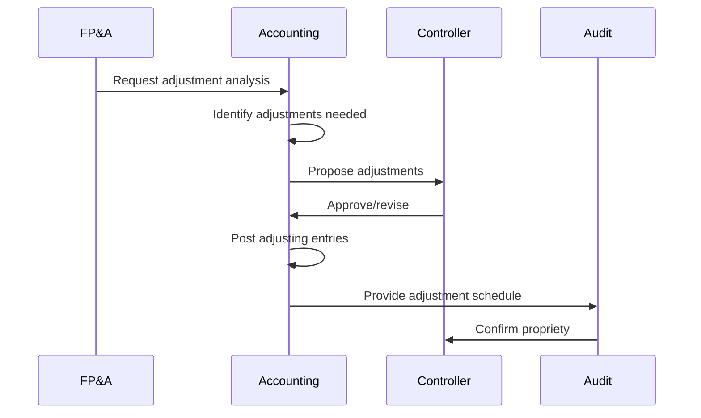
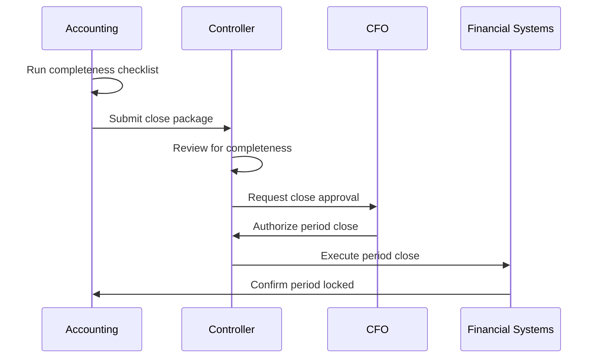
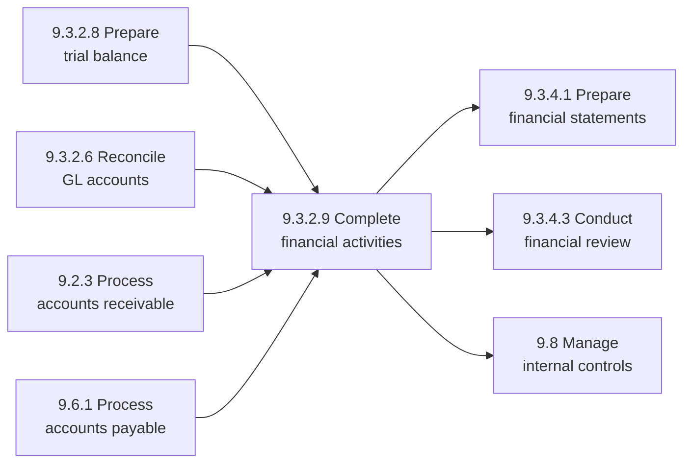

# Complete/finalize financial management activities

> Insuring all payments are received and all activities therein are completed.

## Overview

Complete/finalize financial management activities is a critical closing process within the Manage Financial Resources category (9.0) that ensures all financial transactions are properly recorded, reconciled, and finalized at the end of each reporting period. This process is the culmination of the financial cycle, ensuring that all payments have been received, all expenses have been recorded, and all accounts are properly closed.

This process is essential for producing accurate financial statements, meeting regulatory deadlines, and providing management with reliable financial information. It involves verifying the completeness of all transactions, resolving outstanding items, and ensuring that the financial records accurately reflect the organization's financial position.

## Process Hierarchy



## Key Statistics

| Metric | Value |
|--------|-------|
| APQC Code | 20079 |
| Hierarchy ID | 9.3.2.9 |
| Level | Activity |
| Parent Process | [Perform general accounting](/processes/09-Finance/FinancialManagement) |
| Category | [Manage Financial Resources](/processes/09-Finance) |
| Related Categories | 9.2 Revenue Accounting, 9.6 Accounts Payable |

## Process Flow



## GraphDL Semantic Structure

```
complete.FinancialManagementActivities
```

| Component | Value | Description |
|-----------|-------|-------------|
| Verb | `complete` | Primary action of finishing and finalizing |
| Object | `FinancialManagementActivities` | All financial transactions and processes for the period |
| Preposition | - | Not applicable for this activity |
| PrepObject | - | Not applicable for this activity |

## Activities

### Review and Confirm Payment Receipt

Verifying that all expected payments have been received and properly recorded in the accounting system.



**Tasks:**
- `review.ReceivablesAging` - Analyze outstanding receivables
- `verify.PaymentReceipts` - Confirm all payments received
- `match.PaymentsToInvoices` - Apply payments to invoices
- `resolve.PaymentDiscrepancies` - Address payment differences

### Confirm Expense Recording Completeness

Ensuring all expenses for the period have been properly recorded and accrued.



**Tasks:**
- `review.PayablesAging` - Analyze outstanding payables
- `verify.ExpenseRecording` - Confirm all expenses captured
- `process.Accruals` - Record period-end accruals
- `validate.CutoffProcedures` - Ensure proper period assignment

### Reconcile Bank and Cash Accounts

Matching internal cash records with external bank statements to ensure accuracy.



**Tasks:**
- `obtain.BankStatements` - Retrieve all bank records
- `compare.BankToBook` - Match transactions
- `identify.ReconciliationItems` - List outstanding items
- `resolve.Differences` - Clear reconciling items

### Clear Suspense and Clearing Accounts

Resolving all temporary account balances before period close.



**Tasks:**
- `identify.SuspenseItems` - List all suspense balances
- `research.UnclassifiedItems` - Determine proper coding
- `process.Reclassifications` - Move to correct accounts
- `verify.AccountClearing` - Confirm zero balances

### Process Period-End Adjustments

Recording any final adjusting entries required for accurate financial statements.



**Tasks:**
- `identify.AdjustmentNeeds` - Determine required entries
- `prepare.AdjustingEntries` - Draft journal entries
- `obtain.ApprovalForAdjustments` - Secure authorization
- `post.Adjustments` - Record to general ledger

### Validate Completeness and Close Period

Final verification that all activities are complete before locking the financial period.



**Tasks:**
- `execute.CompletenessChecklist` - Verify all steps complete
- `prepare.ClosePackage` - Compile close documentation
- `obtain.CloseApproval` - Secure management authorization
- `lock.FinancialPeriod` - Finalize period in system

## RACI Matrix

| Activity | Responsible | Accountable | Consulted | Informed |
|----------|-------------|-------------|-----------|----------|
| Confirm payment receipt | AR Team | Controller | Treasury | CFO |
| Confirm expense recording | AP Team | Controller | Procurement | CFO |
| Reconcile bank accounts | Treasury | Controller | External auditors | CFO |
| Clear suspense accounts | Accounting | Controller | Department heads | Management |
| Process adjustments | Accounting | Controller | FP&A | Audit committee |
| Close financial period | Controller | CFO | External auditors | Board |

## Related Departments

- [Accounting](/departments/Accounting) - Primary ownership of period close
- [Finance](/departments/Finance) - Overall financial operations oversight
- [Treasury](/departments/Treasury) - Cash and bank reconciliation
- [Accounts Receivable](/departments/AR) - Payment collection verification
- [Accounts Payable](/departments/AP) - Expense recording verification

## Related Occupations

- [Accountants and Auditors](/occupations/Accountants) - Close execution
- [Financial Managers](/occupations/FinancialManagers) - Close oversight
- [Bookkeeping Clerks](/occupations/BookkeepingClerks) - Transaction processing
- [Controllers](/occupations/Controllers) - Close approval
- [Chief Financial Officers](/occupations/CFO) - Final authorization

## Industry Variations

### Aerospace and Defense

Period close in aerospace must account for long-term contracts, progress billing, and government compliance requirements. The close process includes earned value calculations and contract revenue recognition.

**Industry-Specific Activities:**
- Finalize program accounting entries
- Complete earned value reporting
- Verify government contract compliance
- Process progress billing adjustments

### Banking

Banking period close emphasizes regulatory reporting, loan loss provisioning, and interest accruals. Multiple regulatory deadlines drive close timing requirements.

**Industry-Specific Activities:**
- Complete loan loss reserve calculations
- Finalize interest income/expense accruals
- Prepare regulatory capital calculations
- Process interbank settlement items

### Healthcare Provider

Healthcare period close focuses on revenue cycle completeness, payer settlements, and complex accrual calculations. The close must accommodate delayed claim adjudication.

**Industry-Specific Activities:**
- Estimate unbilled patient revenue
- Calculate payer settlement accruals
- Process charity care adjustments
- Complete cost report calculations

### Retail

Retail period close addresses inventory valuation, sales returns reserves, and vendor rebate accruals. Seasonal fluctuations require careful accrual management.

**Industry-Specific Activities:**
- Complete inventory counts and adjustments
- Calculate sales return reserves
- Process vendor rebate accruals
- Reconcile POS to general ledger

### Property and Casualty Insurance

Insurance period close involves complex reserve calculations, reinsurance accounting, and statutory reporting requirements.

**Industry-Specific Activities:**
- Finalize loss reserve estimates
- Complete reinsurance recoverable calculations
- Process premium earning patterns
- Prepare statutory financial statements

## Close Checklist

| Step | Description | Owner | Due |
|------|-------------|-------|-----|
| 1 | Verify all subledgers posted | Accounting | Day 1 |
| 2 | Complete bank reconciliations | Treasury | Day 2 |
| 3 | Review and clear suspense | Accounting | Day 2 |
| 4 | Process intercompany entries | Accounting | Day 3 |
| 5 | Complete fixed asset processing | FA Accounting | Day 3 |
| 6 | Record accruals and adjustments | Accounting | Day 4 |
| 7 | Perform variance analysis | FP&A | Day 4 |
| 8 | Management review and approval | Controller | Day 5 |
| 9 | Lock period and archive | Systems | Day 5 |

## Related Processes



## Metrics & KPIs

| Metric | Description | Target |
|--------|-------------|--------|
| Close Cycle Time | Business days from period end to close | <5 days |
| Adjustment Rate | Adjustments as % of total entries | <2% |
| First-Time Close Rate | Periods closed without reopening | >95% |
| Suspense Clearing Rate | Suspense items cleared by close | 100% |
| Reconciliation Completion | Accounts reconciled by deadline | 100% |
| Open Items Carryover | Outstanding items at close | <5 items |

## Close Calendar

| Period Type | Close Deadline | Key Milestones |
|-------------|---------------|----------------|
| Monthly | Day 5 | Subledgers Day 2, Reconciliations Day 3 |
| Quarterly | Day 10 | Monthly close + external reporting |
| Annual | Day 20 | Year-end audit requirements |
| Flash Close | Day 2 | Preliminary numbers only |

---

*Source: APQC PCF 20079 (9.3.2.9) - Cross-Industry*
