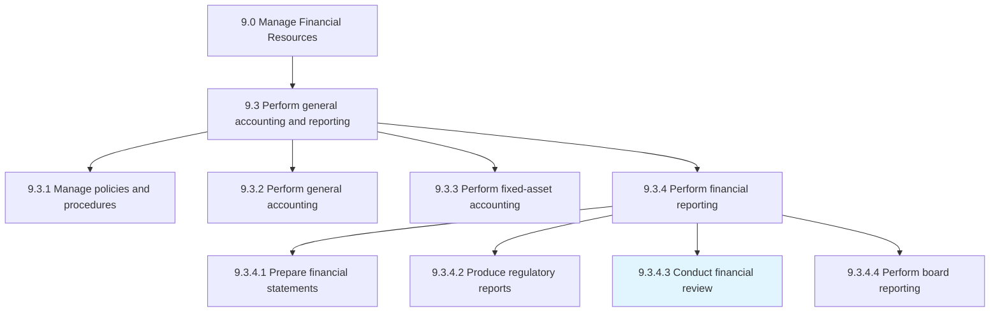
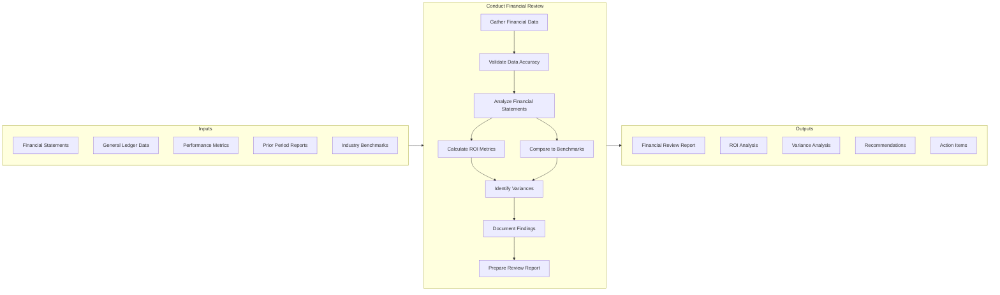
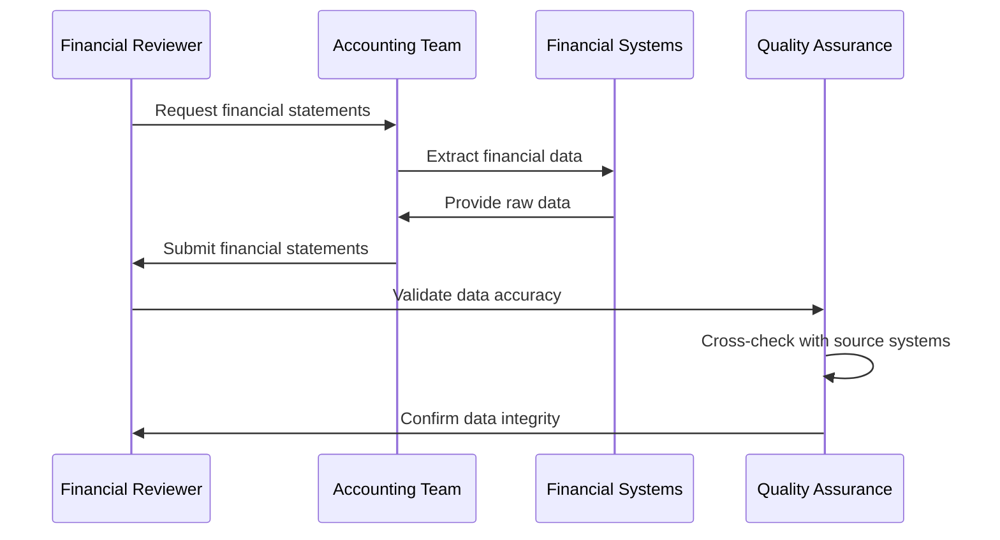
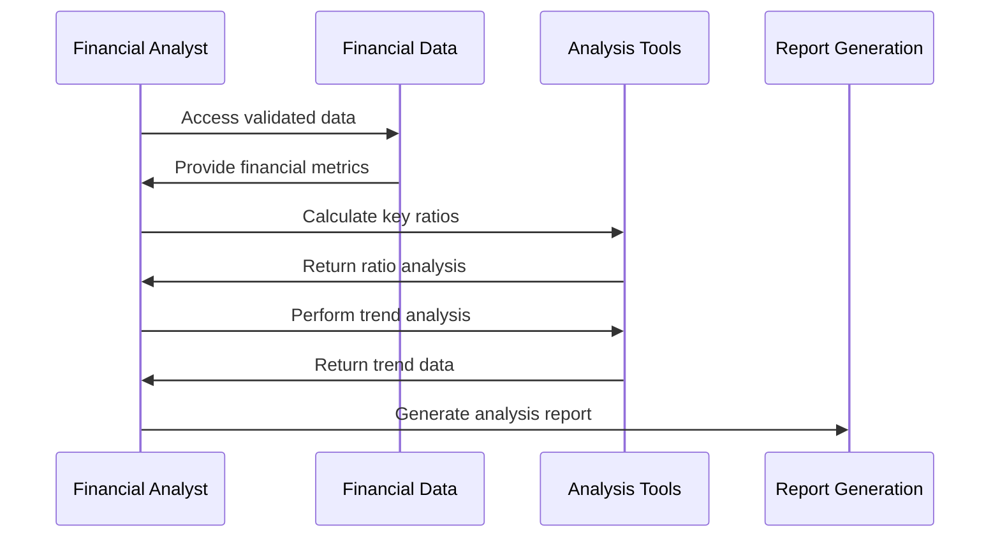
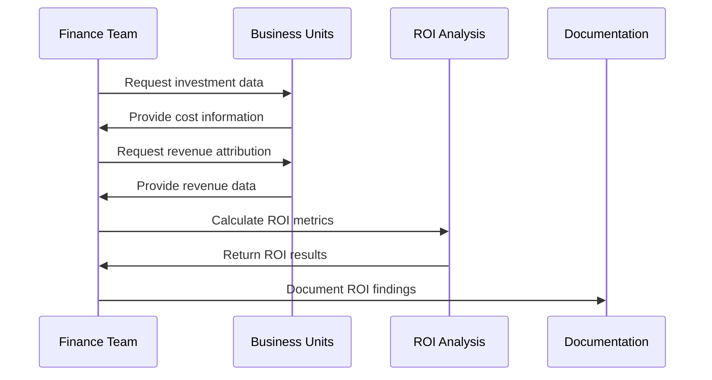
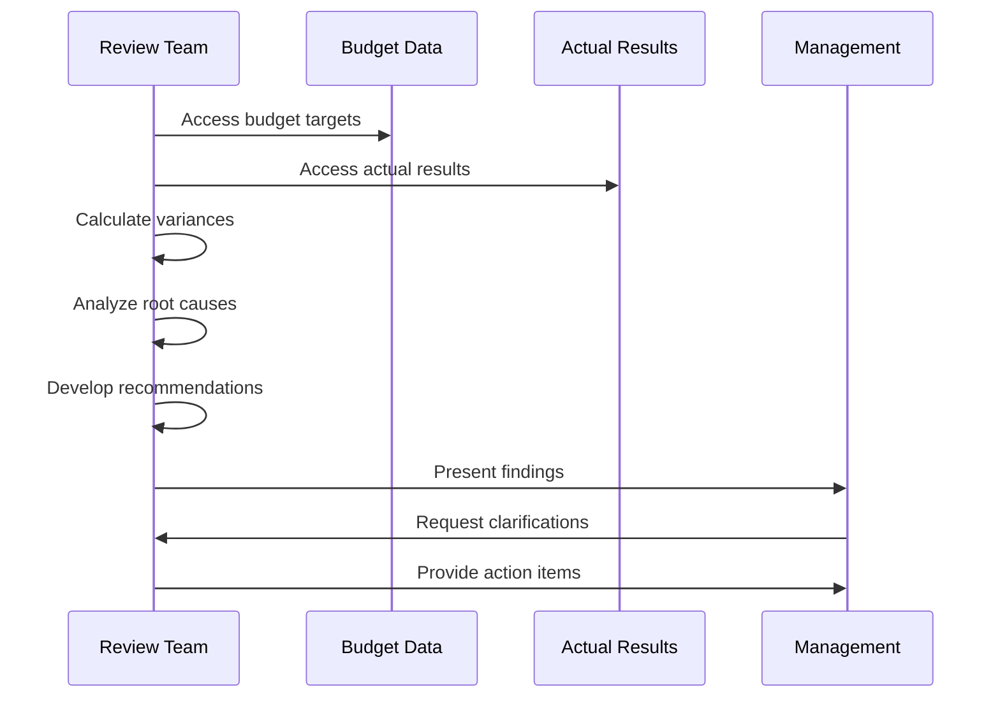
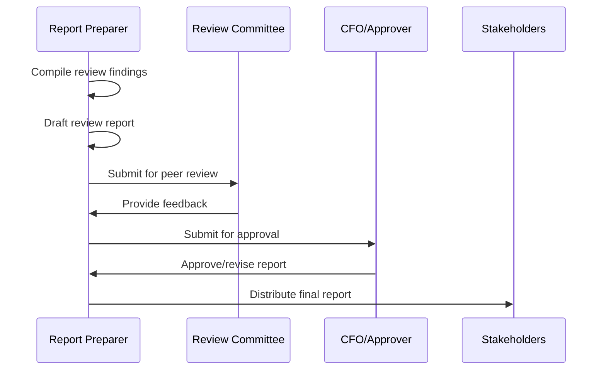
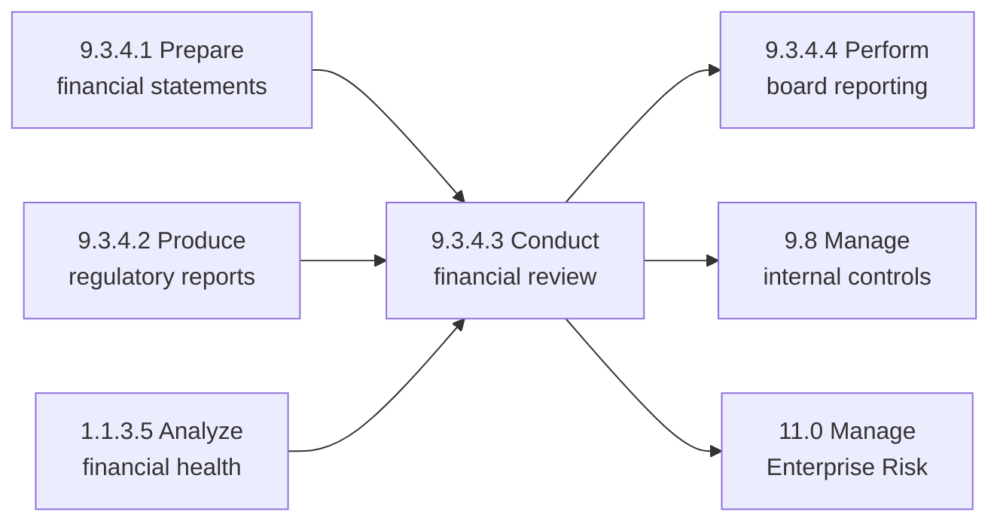

# Conduct financial review

> Evaluating organization's financial reports and financial reporting processes. Review and document the ROI catered by the product/service delivery to the customer in the market.

## Overview

Conduct financial review is a critical process within the Manage Financial Resources category (9.0) that ensures the accuracy, completeness, and reliability of financial information. This process involves systematic examination of financial statements, reporting processes, and performance metrics to identify discrepancies, ensure compliance, and provide stakeholders with confidence in the organization's financial position.

Financial reviews serve multiple purposes: validating the integrity of financial data, assessing operational efficiency through ROI analysis, supporting management decision-making, and satisfying regulatory and governance requirements. The review process bridges the gap between raw financial data and actionable business intelligence.

## Process Hierarchy



## Key Statistics

| Metric | Value |
|--------|-------|
| APQC Code | 11427 |
| Hierarchy ID | 9.3.4.3 |
| Level | Activity |
| Parent Process | [Perform financial reporting](/processes/09-Finance/FinancialManagement) |
| Category | [Manage Financial Resources](/processes/09-Finance) |
| Related Categories | 1.0 Strategy, 11.0 Risk Management |

## Process Flow



## GraphDL Semantic Structure

```
conduct.FinancialReview
```

| Component | Value | Description |
|-----------|-------|-------------|
| Verb | `conduct` | Primary action of performing and executing |
| Object | `FinancialReview` | The systematic examination of financial information |
| Preposition | - | Not applicable for this activity |
| PrepObject | - | Not applicable for this activity |

## Activities

### Gather and Validate Financial Data

Collecting all relevant financial information and ensuring its accuracy and completeness before analysis begins.



**Tasks:**
- `gather.FinancialStatements` - Collect balance sheet, income statement, cash flow
- `validate.DataAccuracy` - Verify figures against source systems
- `reconcile.AccountBalances` - Ensure inter-account consistency
- `verify.Completeness` - Confirm all required data is present

### Analyze Financial Performance

Examining financial statements to assess organizational performance, profitability, and financial health.



**Tasks:**
- `analyze.ProfitabilityRatios` - Calculate ROA, ROE, margins
- `analyze.LiquidityRatios` - Assess current and quick ratios
- `analyze.EfficiencyRatios` - Evaluate turnover metrics
- `perform.TrendAnalysis` - Identify patterns over time

### Calculate and Document ROI

Measuring the return on investment for products, services, and organizational initiatives.



**Tasks:**
- `calculate.InvestmentROI` - Determine return on investments
- `measure.ProductROI` - Assess product line profitability
- `evaluate.ServiceROI` - Analyze service delivery returns
- `document.ROIFindings` - Record and communicate results

### Identify Variances and Recommendations

Comparing actual performance to budgets, forecasts, and benchmarks to identify areas of concern or opportunity.



**Tasks:**
- `compare.BudgetToActual` - Identify budget variances
- `analyze.VarianceRootCauses` - Determine causes of variances
- `develop.CorrectiveActions` - Create improvement recommendations
- `prioritize.ActionItems` - Rank recommendations by impact

### Prepare and Distribute Review Report

Compiling findings into a comprehensive report for stakeholders and ensuring proper distribution.



**Tasks:**
- `compile.ReviewFindings` - Aggregate all analysis results
- `draft.ReviewReport` - Create comprehensive report document
- `obtain.Approval` - Secure management sign-off
- `distribute.Report` - Share with appropriate stakeholders

## RACI Matrix

| Activity | Responsible | Accountable | Consulted | Informed |
|----------|-------------|-------------|-----------|----------|
| Gather financial data | Accounting | Controller | Finance | Management |
| Validate data accuracy | Internal Audit | Controller | External auditors | CFO |
| Analyze financial performance | FP&A | CFO | Business units | Executive team |
| Calculate ROI metrics | Financial Analyst | CFO | Product managers | Board |
| Identify variances | FP&A | Controller | Department heads | Management |
| Prepare review report | Finance Manager | CFO | Internal Audit | Stakeholders |

## Related Departments

- [Finance](/departments/Finance) - Primary ownership of financial review process
- [Accounting](/departments/Accounting) - Source of financial data
- [Internal Audit](/departments/InternalAudit) - Independent review and validation
- [FP&A](/departments/FPA) - Analysis and forecasting support
- [Strategy](/departments/Strategy) - Consumer of ROI insights

## Related Occupations

- [Financial Managers](/occupations/FinancialManagers) - Review execution and oversight
- [Financial Analysts](/occupations/FinancialAnalysts) - Analysis and reporting
- [Accountants and Auditors](/occupations/Accountants) - Data validation and compliance
- [Chief Financial Officers](/occupations/CFO) - Accountability and approval
- [Budget Analysts](/occupations/BudgetAnalysts) - Variance analysis

## Industry Variations

### Aerospace and Defense

Financial reviews in aerospace focus on program-level profitability, contract compliance, and earned value analysis. Reviews must address government contract requirements and long-term program accounting.

**Industry-Specific Activities:**
- Review program-level financial performance
- Assess contract profitability by type (cost-plus, fixed-price)
- Validate earned value management metrics
- Ensure FAR/DFAR compliance in reporting

### Banking

Banking financial reviews emphasize regulatory capital adequacy, credit quality metrics, and net interest margin analysis. Reviews must satisfy multiple regulatory requirements.

**Industry-Specific Activities:**
- Review regulatory capital ratios (CET1, Tier 1, Total)
- Analyze loan loss provisions and credit quality
- Assess net interest margin trends
- Validate compliance with Basel requirements

### Healthcare Provider

Healthcare financial reviews focus on revenue cycle metrics, payer mix analysis, and service line profitability. Reviews must consider complex reimbursement structures.

**Industry-Specific Activities:**
- Analyze revenue cycle KPIs (days in AR, denial rates)
- Review payer mix and reimbursement trends
- Assess service line contribution margins
- Validate compliance with healthcare billing regulations

### Retail

Retail financial reviews emphasize same-store sales analysis, inventory metrics, and seasonal performance patterns. Reviews must address omnichannel revenue recognition.

**Industry-Specific Activities:**
- Review same-store sales growth and trends
- Analyze inventory turnover and GMROI
- Assess seasonal performance patterns
- Validate omnichannel revenue recognition

### Property and Casualty Insurance

Insurance financial reviews focus on loss ratios, reserve adequacy, and investment portfolio performance. Reviews must address regulatory capital requirements.

**Industry-Specific Activities:**
- Analyze combined ratio and loss ratio trends
- Review reserve adequacy and development
- Assess investment portfolio returns
- Validate statutory financial statements

## Sub-Activities

| Activity | Description |
|----------|-------------|
| Review balance sheet | Examine asset, liability, and equity accounts |
| Analyze income statement | Evaluate revenue, expenses, and profitability |
| Examine cash flow statement | Assess operating, investing, and financing flows |
| Calculate financial ratios | Compute profitability, liquidity, and solvency metrics |
| Perform comparative analysis | Compare to prior periods and budgets |
| Benchmark performance | Compare to industry peers |
| Document exceptions | Record findings requiring attention |
| Develop recommendations | Create actionable improvement suggestions |

## Related Processes



## Metrics & KPIs

| Metric | Description | Target |
|--------|-------------|--------|
| Review Cycle Time | Time from data gathering to report distribution | <5 business days |
| Finding Resolution Rate | Percentage of findings addressed within timeline | >90% |
| Data Accuracy Rate | Percentage of data elements validated without error | 100% |
| Stakeholder Satisfaction | Rating of review usefulness by recipients | >4.0/5.0 |
| Variance Detection Rate | Significant variances identified vs. total | 100% detection |
| Report Timeliness | On-time delivery of scheduled reviews | 100% |

## Review Frequency

| Review Type | Frequency | Primary Focus |
|-------------|-----------|---------------|
| Flash Review | Weekly | Key operational metrics |
| Management Review | Monthly | Comprehensive financial performance |
| Quarterly Review | Quarterly | Trend analysis and forecasting |
| Annual Review | Annually | Full-year performance and strategic alignment |
| Ad-hoc Review | As needed | Specific issues or opportunities |

---

*Source: APQC PCF 11427 (9.3.4.3) - Cross-Industry*
