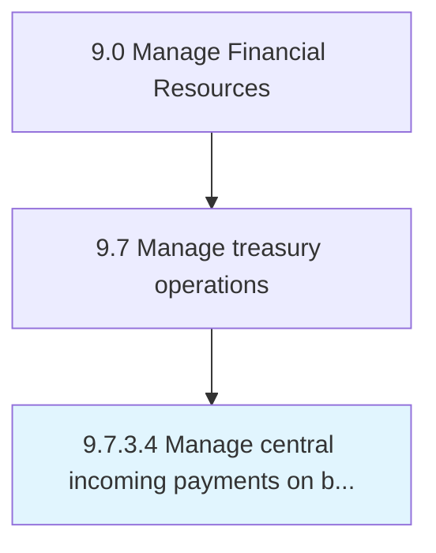

# Manage central incoming payments on behalf of subsidiaries

> Handling payments received by parent company for subsidiaries.

## Overview

Activity 9.7.3.4 is an activity within the Manage Financial Resources framework. 

Handling payments received by parent company for subsidiaries.

## Process Hierarchy



## Key Statistics

| Metric | Value |
|--------|-------|
| APQC Code | 10904 |
| Hierarchy ID | 9.7.3.4 |
| Level | Activity |
| Parent | [9.7.3](../) |
| Sub-Processes | 0 |


## GraphDL Semantic Structure

```
manage.CentralIncomingPayments.on.BehalfOfSubsidiaries
```

| Component | Value | Description |
|-----------|-------|-------------|
| Verb | `manage` | Primary action |
| Object | `central incoming payments` | Direct object |
| Preposition | `on` | Relationship |
| PrepObject | `behalf of subsidiaries` | Indirect object |


## Related Concepts

- CentralIncomingPayments
- BehalfOfSubsidiaries


---

*Source: APQC PCF 10904 (9.7.3.4) - APQC*
