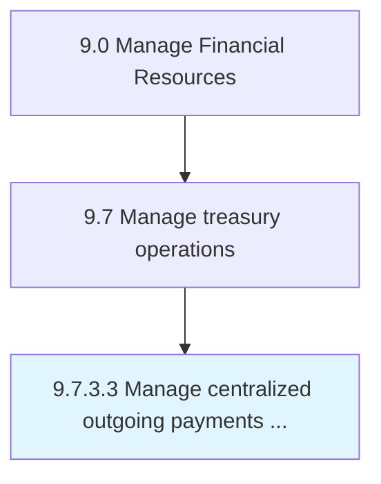

# Manage centralized outgoing payments on behalf of subsidiaries

> Handling payments made for subsidiaries by parent company.

## Overview

Activity 9.7.3.3 is an activity within the Manage Financial Resources framework. 

Handling payments made for subsidiaries by parent company.

## Process Hierarchy



## Key Statistics

| Metric | Value |
|--------|-------|
| APQC Code | 10903 |
| Hierarchy ID | 9.7.3.3 |
| Level | Activity |
| Parent | [9.7.3](../) |
| Sub-Processes | 0 |


## GraphDL Semantic Structure

```
manage.CentralizedOutgoingPayments.on.BehalfOfSubsidiaries
```

| Component | Value | Description |
|-----------|-------|-------------|
| Verb | `manage` | Primary action |
| Object | `centralized outgoing payments` | Direct object |
| Preposition | `on` | Relationship |
| PrepObject | `behalf of subsidiaries` | Indirect object |


## Related Concepts

- CentralizedOutgoingPayments
- BehalfOfSubsidiaries


---

*Source: APQC PCF 10903 (9.7.3.3) - APQC*
