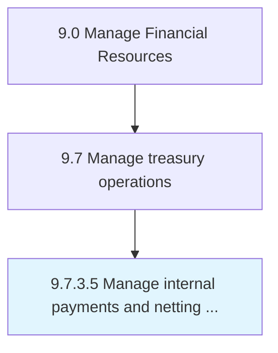

# Manage internal payments and netting transactions

> Taking care of all business outflows and recording as whole.

## Overview

Activity 9.7.3.5 is an activity within the Manage Financial Resources framework. 

Taking care of all business outflows and recording as whole. Manage making all payments for the organization and its units or subsidiaries. Track in books of accounts of parent company.

## Process Hierarchy



## Key Statistics

| Metric | Value |
|--------|-------|
| APQC Code | 10905 |
| Hierarchy ID | 9.7.3.5 |
| Level | Activity |
| Parent | [9.7.3](../) |
| Sub-Processes | 0 |


## GraphDL Semantic Structure

```
manage.InternalPaymentsAndNettingTransactions
```

| Component | Value | Description |
|-----------|-------|-------------|
| Verb | `manage` | Primary action |
| Object | `internal payments and netting transactions` | Direct object |


## Related Concepts

- [InternalPaymentsTransactions](/concepts/InternalPaymentsTransactions)
- [NettingTransactions](/concepts/NettingTransactions)


---

*Source: APQC PCF 10905 (9.7.3.5) - APQC*
