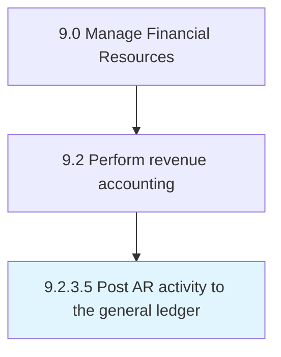

# Post AR activity to the general ledger

> Preparing the general ledger for account receivables from journals.

## Overview

Activity 9.2.3.5 is an activity within the Manage Financial Resources framework. 

Preparing the general ledger for account receivables from journals. Place all journal entries related to accounts receivables in the general ledger accounts of a business.

## Process Hierarchy



## Key Statistics

| Metric | Value |
|--------|-------|
| APQC Code | 10803 |
| Hierarchy ID | 9.2.3.5 |
| Level | Activity |
| Parent | [9.2.3](../) |
| Sub-Processes | 0 |


## GraphDL Semantic Structure

```
post.ARActivity.to.TheGeneralLedger
```

| Component | Value | Description |
|-----------|-------|-------------|
| Verb | `post` | Primary action |
| Object | `AR activity` | Direct object |
| Preposition | `to` | Relationship |
| PrepObject | `the general ledger` | Indirect object |


## Related Concepts

- [ARActivity](/concepts/ARActivity)
- [GeneralLedger](/concepts/GeneralLedger)


---

*Source: APQC PCF 10803 (9.2.3.5) - APQC*
