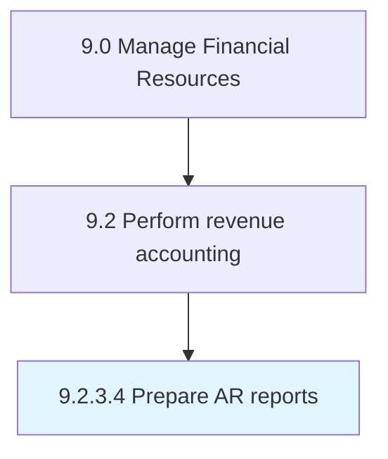

# Prepare AR reports

> Preparing reports that detail balances due or what to collect from customers at a certain point in time.

## Overview

Activity 9.2.3.4 is an activity within the Manage Financial Resources framework. 

Preparing reports that detail balances due or what to collect from customers at a certain point in time.

## Process Hierarchy



## Key Statistics

| Metric | Value |
|--------|-------|
| APQC Code | 10802 |
| Hierarchy ID | 9.2.3.4 |
| Level | Activity |
| Parent | [9.2.3](../) |
| Sub-Processes | 0 |


## GraphDL Semantic Structure

```
prepare.ARReports
```

| Component | Value | Description |
|-----------|-------|-------------|
| Verb | `prepare` | Primary action |
| Object | `AR reports` | Direct object |


## Related Concepts

- ARReports


---

*Source: APQC PCF 10802 (9.2.3.4) - APQC*
