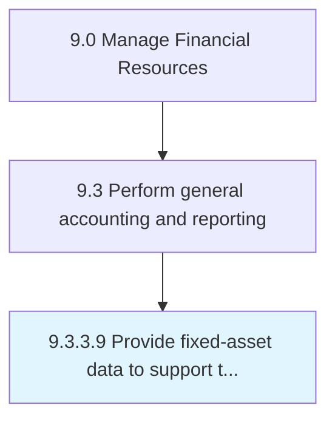

# Provide fixed-asset data to support tax, statutory, and regulatory reporting

> Showing market value and related expenses on fixed assets data for taxation.

## Overview

Activity 9.3.3.9 is an activity within the Manage Financial Resources framework. 

Showing market value and related expenses on fixed assets data for taxation. Provide complete information recorded in the books of fixed assets about purchase price, depreciation, installation charges, resale market value etc. for tax and regulatory purposes.

## Process Hierarchy



## Key Statistics

| Metric | Value |
|--------|-------|
| APQC Code | 10836 |
| Hierarchy ID | 9.3.3.9 |
| Level | Activity |
| Parent | [9.3.3](../) |
| Sub-Processes | 0 |


## GraphDL Semantic Structure

```
provide.FixedassetData.to.SupportTaxStatutoryAndRegulatoryReporting
```

| Component | Value | Description |
|-----------|-------|-------------|
| Verb | `provide` | Primary action |
| Object | `fixed-asset data` | Direct object |
| Preposition | `to` | Relationship |
| PrepObject | `support tax, statutory, and regulatory reporting` | Indirect object |


---

*Source: APQC PCF 10836 (9.3.3.9) - APQC*
