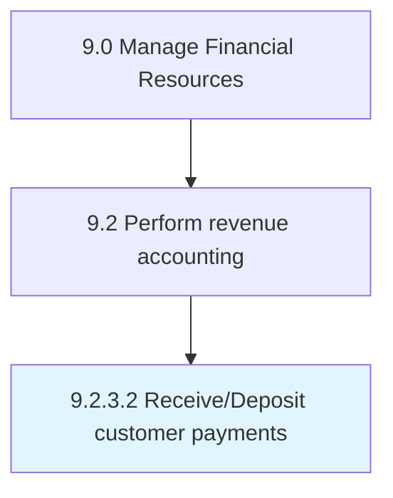

# Receive/Deposit customer payments

> Collecting cash from customers.

## Overview

Activity 9.2.3.2 is an activity within the Manage Financial Resources framework. 

Collecting cash from customers. Deposit it into bank account. Make entries into the books of accounts.

## Process Hierarchy



## Key Statistics

| Metric | Value |
|--------|-------|
| APQC Code | 10800 |
| Hierarchy ID | 9.2.3.2 |
| Level | Activity |
| Parent | [9.2.3](../) |
| Sub-Processes | 0 |


## GraphDL Semantic Structure

```
receive/deposit.CustomerPayments
```

| Component | Value | Description |
|-----------|-------|-------------|
| Verb | `receive/deposit` | Primary action |
| Object | `customer payments` | Direct object |


## Related Concepts

- [CustomerPayments](/concepts/CustomerPayments)
- [CustomerPayments](/concepts/CustomerPayments)


---

*Source: APQC PCF 10800 (9.2.3.2) - APQC*
