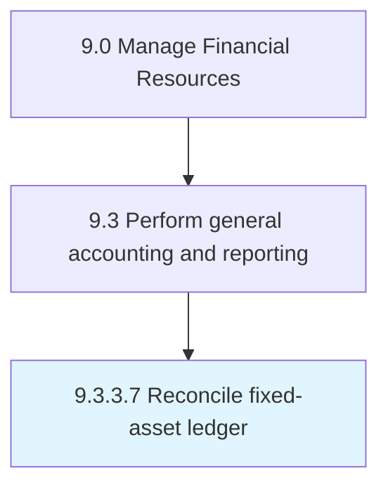

# Reconcile fixed-asset ledger

> Balancing the ledger account balance for fixed assets.

## Overview

Activity 9.3.3.7 is an activity within the Manage Financial Resources framework. 

Balancing the ledger account balance for fixed assets. Correct errors in the books of fixed assets. Provide correct information in relevant accounts.

## Process Hierarchy



## Key Statistics

| Metric | Value |
|--------|-------|
| APQC Code | 10834 |
| Hierarchy ID | 9.3.3.7 |
| Level | Activity |
| Parent | [9.3.3](../) |
| Sub-Processes | 0 |


## GraphDL Semantic Structure

```
reconcile.FixedassetLedger
```

| Component | Value | Description |
|-----------|-------|-------------|
| Verb | `reconcile` | Primary action |
| Object | `fixed-asset ledger` | Direct object |


---

*Source: APQC PCF 10834 (9.3.3.7) - APQC*
