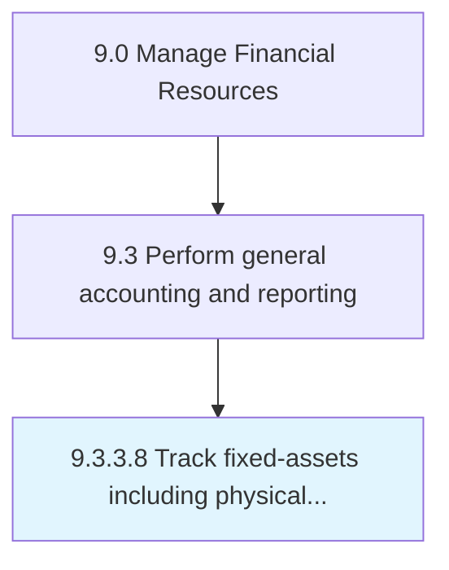

# Track fixed-assets including physical inventory

> Checking and updating the record of all raw materials and fixed assets.

## Overview

Activity 9.3.3.8 is an activity within the Manage Financial Resources framework. 

Checking and updating the record of all raw materials and fixed assets. Track all fixes asset. Maintain a record of all inventory items.

## Process Hierarchy



## Key Statistics

| Metric | Value |
|--------|-------|
| APQC Code | 10835 |
| Hierarchy ID | 9.3.3.8 |
| Level | Activity |
| Parent | [9.3.3](../) |
| Sub-Processes | 0 |


## GraphDL Semantic Structure

```
track.FixedassetsIncludingPhysicalInventory
```

| Component | Value | Description |
|-----------|-------|-------------|
| Verb | `track` | Primary action |
| Object | `fixed-assets including physical inventory` | Direct object |


---

*Source: APQC PCF 10835 (9.3.3.8) - APQC*
