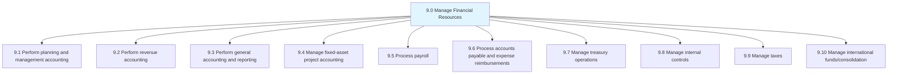
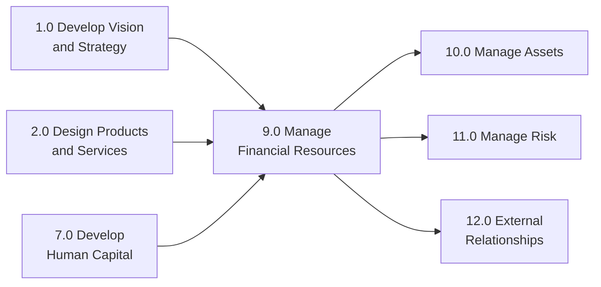

# Manage Financial Resources

*APQC Category 9.0*

> Overseeing key back-office processes for organizations. This category includes process groups related to planning and management accounting, revenue accounting, general accounting and reporting, fixed-asset project accounting, payroll, accounts payable and expense reimbursements, treasury operations, internal controls, tax management, international funds/consolidation, and global trade services.

## Overview

Manage Financial Resources is the ninth category of the APQC Process Classification Framework (PCF). This category encompasses all financial management and accounting activities that form the backbone of organizational operations. From strategic financial planning to daily transaction processing, these processes ensure fiscal responsibility, regulatory compliance, and informed decision-making.

Financial resource management has evolved from basic bookkeeping to a strategic function that provides insights for business decisions, manages risk, ensures compliance, and optimizes capital allocation.

## Process Hierarchy

## Key Statistics

| Metric | Value |
|--------|-------|
| APQC Code | 17058 |
| Hierarchy ID | 9.0 |
| Level | Category |
| Process Groups | 10 |
| Total Sub-Processes | 200+ |

## Process Groups

| Process Group | Code | Description |
|---------------|------|-------------|
| [Perform planning and management accounting](./FinancialManagement) | 9.1 | Budgeting, forecasting, cost accounting, and financial performance management |
| [Perform revenue accounting](./FinancialManagement) | 9.2 | Customer credit, invoicing, accounts receivable, and collections |
| [Perform general accounting and reporting](./FinancialManagement) | 9.3 | General ledger, financial statements, and regulatory reporting |
| [Manage fixed-asset project accounting](./FinancialManagement) | 9.4 | Capital asset tracking, depreciation, and project accounting |
| [Process payroll](./FinancialManagement) | 9.5 | Employee compensation, tax withholding, and benefit deductions |
| [Process accounts payable and expense reimbursements](./FinancialManagement) | 9.6 | Vendor payments, invoice processing, and expense management |
| [Manage treasury operations](./FinancialManagement) | 9.7 | Cash management, investments, debt, and financial risk |
| [Manage internal controls](./FinancialManagement) | 9.8 | Financial controls, audit, and compliance |
| [Manage taxes](./FinancialManagement) | 9.9 | Tax planning, compliance, and reporting |
| [Manage international funds/consolidation](./FinancialManagement) | 9.10 | Multi-entity consolidation and intercompany transactions |

## Processes in this Category

- [Manage Financial Resources](./FinancialManagement) - Core financial management category overview
- [Analyze financial health](./FinancialHealth) - Assessment of organizational financial position
- [Conduct financial review](./FinancialReview) - Evaluation of financial reports and processes
- [Complete/finalize financial management activities](./FinancialActivities) - Closing financial cycles and ensuring completeness
- [Identify compensation requirements based on financial, benefits, and HR policies](./CompensationRequirements) - Determining employee compensation structures

## Related Categories

## Related Departments

- [Finance](/departments/Finance) - Primary ownership
- [Accounting](/departments/Accounting) - Transaction processing
- [Treasury](/departments/Treasury) - Cash and investments
- [Tax](/departments/Tax) - Tax compliance
- [Internal Audit](/departments/InternalAudit) - Control assessment

## Related Occupations

- [Chief Financial Officers](/occupations/CFO)
- [Financial Managers](/occupations/FinancialManagers)
- [Accountants and Auditors](/occupations/Accountants)
- [Financial Analysts](/occupations/FinancialAnalysts)
- [Budget Analysts](/occupations/BudgetAnalysts)

---

*Source: APQC PCF Category 9.0 - Cross-Industry*
