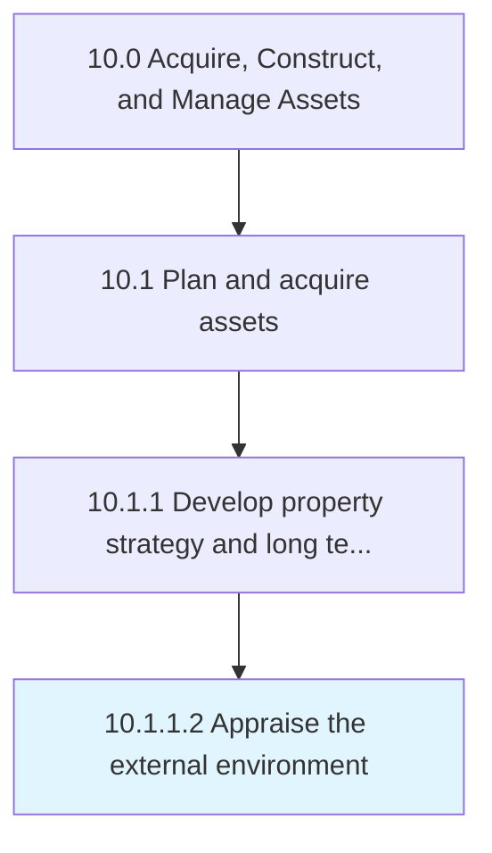

# Appraise the external environment

> Evaluating the impact of the external environment.

## Overview

Activity 10.1.1.2 is an activity within the Acquire, Construct, and Manage Assets framework. 

Evaluating the impact of the external environment. Evaluate the circumstances, objects, events, and aspects surrounding an organization that affects its actions and selections and that recognizes its opportunities and risks.

## Process Hierarchy



## Key Statistics

| Metric | Value |
|--------|-------|
| APQC Code | 10956 |
| Hierarchy ID | 10.1.1.2 |
| Level | Activity |
| Parent | [10.1.1](../) |
| Sub-Processes | 0 |


## GraphDL Semantic Structure

```
appraise.TheExternalEnvironment
```

| Component | Value | Description |
|-----------|-------|-------------|
| Verb | `appraise` | Primary action |
| Object | `the external environment` | Direct object |


## Related Concepts

- ExternalEnvironment


---

*Source: APQC PCF 10956 (10.1.1.2) - APQC*
