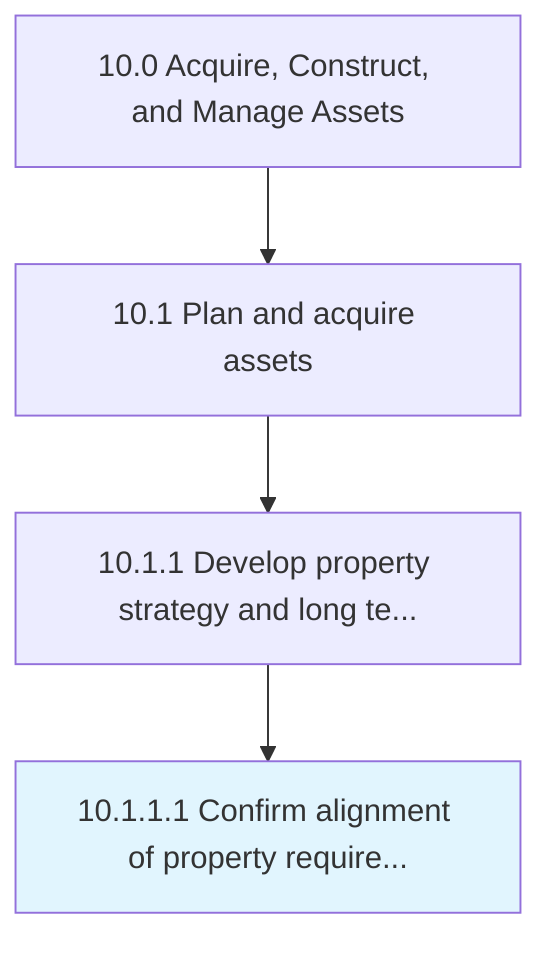

# Confirm alignment of property requirements with business strategy

> Creating alignment between the requirement of properties and the overall business strategy.

## Overview

Activity 10.1.1.1 is an activity within the Acquire, Construct, and Manage Assets framework. 

Creating alignment between the requirement of properties and the overall business strategy. This process requires the organization to align the requirement of properties in accordance with its business strategies of the organization.

## Process Hierarchy



## Key Statistics

| Metric | Value |
|--------|-------|
| APQC Code | 10955 |
| Hierarchy ID | 10.1.1.1 |
| Level | Activity |
| Parent | [10.1.1](../) |
| Sub-Processes | 0 |


## GraphDL Semantic Structure

```
confirm.Alignment.of.PropertyRequirementsWithBusinessStrategy
```

| Component | Value | Description |
|-----------|-------|-------------|
| Verb | `confirm` | Primary action |
| Object | `alignment` | Direct object |
| Preposition | `of` | Relationship |
| PrepObject | `property requirements with business strategy` | Indirect object |


## Related Concepts

- Alignment
- PropertyRequirementsWithBusinessStrategy


---

*Source: APQC PCF 10955 (10.1.1.1) - APQC*
