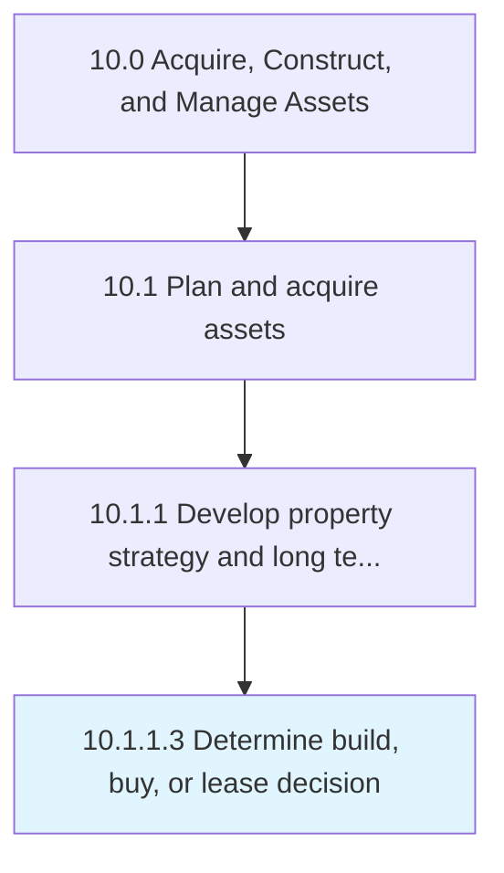

# Determine build, buy, or lease decision

> Deciding whether to buy or build properties.

## Overview

Activity 10.1.1.3 is an activity within the Acquire, Construct, and Manage Assets framework. 

Deciding whether to buy or build properties. Study the market forces about property prices and cost of construction in order to take decisions based on the market research.

## Process Hierarchy



## Key Statistics

| Metric | Value |
|--------|-------|
| APQC Code | 10957 |
| Hierarchy ID | 10.1.1.3 |
| Level | Activity |
| Parent | [10.1.1](../) |
| Sub-Processes | 0 |


## GraphDL Semantic Structure

```
determine.BuildBuyOrLeaseDecision
```

| Component | Value | Description |
|-----------|-------|-------------|
| Verb | `determine` | Primary action |
| Object | `build, buy, or lease decision` | Direct object |


## Related Concepts

- [Build](/concepts/Build)
- [Buy](/concepts/Buy)
- [LeaseDecision](/concepts/LeaseDecision)


---

*Source: APQC PCF 10957 (10.1.1.3) - APQC*
