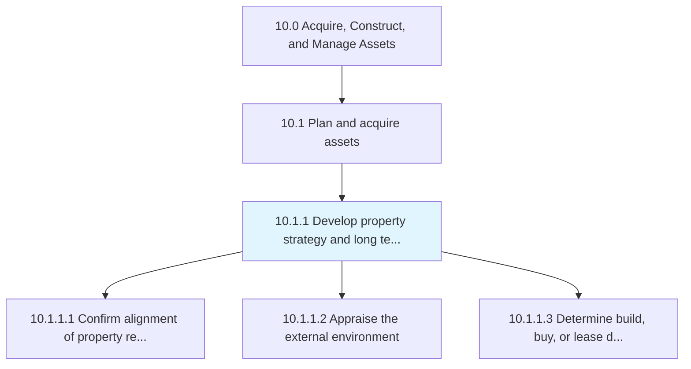
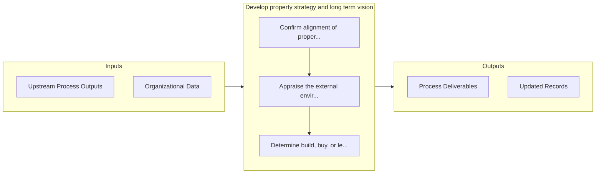

# Develop property strategy and long term vision

> Strategizing a long-term vision for managing properties.

## Overview

Process 10.1.1 is a core process that defines the specific procedures for develop property strategy and long term vision. 

Strategizing a long-term vision for managing properties. Prepare strategies and a long-term vision for managing purchased/retained properties.

## Process Hierarchy



## Key Statistics

| Metric | Value |
|--------|-------|
| APQC Code | 10941 |
| Hierarchy ID | 10.1.1 |
| Level | Process |
| Parent | [10.1](../) |
| Sub-Processes | 3 |


## GraphDL Semantic Structure

```
develop.PropertyStrategyAndLongTermVision
```

| Component | Value | Description |
|-----------|-------|-------------|
| Verb | `develop` | Primary action |
| Object | `property strategy and long term vision` | Direct object |


## Process Flow



## Sub-Processes

| Process | Hierarchy ID | Description |
|---------|-------------|-------------|
| [Confirm alignment of property requirements with business strategy](./ConfirmAlignmentOfPropertyRequirementsWithBusinessStrategy) | 10.1.1.1 | Creating alignment between the requirement of properties and the overall business strategy |
| [Appraise the external environment](./AppraiseTheExternalEnvironment) | 10.1.1.2 | Evaluating the impact of the external environment |
| [Determine build, buy, or lease decision](./DetermineBuildBuyOrLeaseDecision) | 10.1.1.3 | Deciding whether to buy or build properties |


## Related Concepts

- [PropertyStrategy](/concepts/PropertyStrategy)
- [LongTermVision](/concepts/LongTermVision)


---

*Source: APQC PCF 10941 (10.1.1) - APQC*
