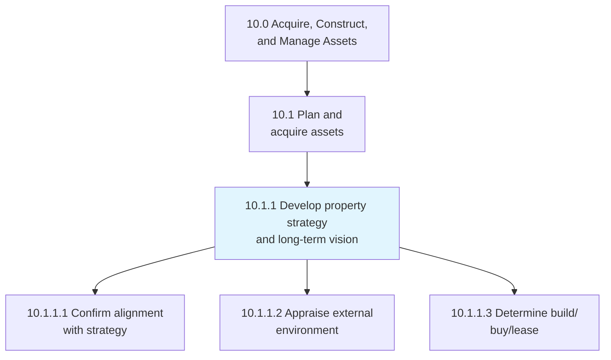
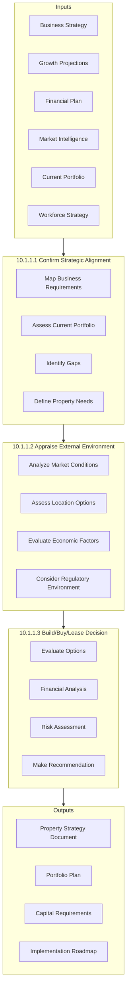
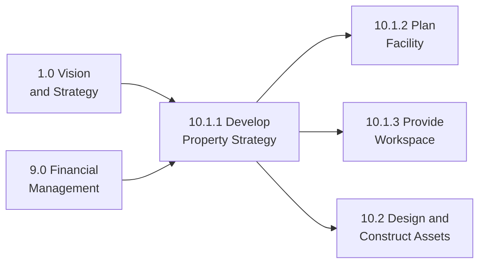

# Develop property strategy and long term vision

> Strategizing a long-term vision for managing properties by aligning real estate decisions with business strategy, assessing market conditions, and determining optimal acquisition approaches.

## Overview

Process 10.1.1 establishes the strategic foundation for all property-related decisions. This includes ensuring property requirements align with business objectives, evaluating external market conditions, and making informed build/buy/lease decisions that optimize capital deployment and operational flexibility.

Effective property strategy balances long-term growth projections, financial constraints, operational requirements, and market opportunities. This process typically operates on multi-year planning horizons and integrates with corporate strategy, financial planning, and workforce planning cycles.

## Process Hierarchy



## Key Statistics

| Metric | Value |
|--------|-------|
| APQC Code | 10941 |
| Hierarchy ID | 10.1.1 |
| Level | Process |
| Parent | [10.1 Plan and acquire assets](../) |
| Category | [10.0 Acquire, Construct, and Manage Assets](../../) |
| Sub-Processes | 3 |

## Process Flow



## GraphDL Semantic Structure

```graphdl
develop.PropertyStrategy.and.LongTermVision
```

| Component | Value | Description |
|-----------|-------|-------------|
| Verb | `develop` | Strategic planning action |
| Object | `PropertyStrategy` | Real estate approach |
| Conjunction | `and` | Additional element |
| Object2 | `LongTermVision` | Future-state planning |

### Decomposed Actions

| Activity | GraphDL Structure |
|----------|-------------------|
| 10.1.1.1 | `confirm.Alignment.of.PropertyRequirements.with.BusinessStrategy` |
| 10.1.1.2 | `appraise.ExternalEnvironment` |
| 10.1.1.3 | `determine.BuildBuyOrLeaseDecision` |

## Sub-Processes

### [10.1.1.1 Confirm alignment of property requirements with business strategy](./ConfirmAlignmentOfPropertyRequirementsWithBusinessStrategy)

Creating alignment between property requirements and overall business strategy to ensure real estate investments support organizational objectives.

**Key Activities:**
- Translate business strategy into space requirements
- Assess current portfolio against future needs
- Identify geographic and capacity requirements
- Define timing and phasing of property needs
- Document strategic property requirements

### [10.1.1.2 Appraise the external environment](./AppraiseTheExternalEnvironment)

Evaluating the impact of external factors including real estate market conditions, economic trends, and regulatory environments on property decisions.

**Key Activities:**
- Analyze real estate market conditions and trends
- Evaluate location options and accessibility
- Assess economic and demographic factors
- Consider regulatory and zoning requirements
- Identify opportunities and risks

### [10.1.1.3 Determine build, buy, or lease decision](./DetermineBuildBuyOrLeaseDecision)

Deciding whether to build, buy, or lease properties based on financial analysis, strategic fit, and risk considerations.

**Key Activities:**
- Develop option scenarios (build/buy/lease)
- Conduct financial modeling and comparison
- Assess strategic and operational fit
- Evaluate risks for each option
- Make and document recommendation

## RACI Matrix

| Activity | Responsible | Accountable | Consulted | Informed |
|----------|-------------|-------------|-----------|----------|
| Confirm Alignment | Real Estate Team | VP Real Estate | Strategy, Finance | Executive Team |
| Appraise Environment | Real Estate Team | VP Real Estate | External Advisors | Finance, Legal |
| Build/Buy/Lease Decision | Real Estate Team | CFO/COO | Finance, Legal, Operations | Board |

## Key Stakeholders

| Stakeholder | Role | Responsibilities |
|-------------|------|------------------|
| Chief Executive Officer | Strategic Sponsor | Strategic direction alignment |
| Chief Financial Officer | Investment Approval | Capital allocation decisions |
| VP of Real Estate | Process Owner | Strategy development and execution |
| Chief Operating Officer | Operational Lead | Operational requirements |
| VP of HR | Workforce Planning | Headcount and location needs |
| External Real Estate Advisors | Market Expertise | Market intelligence and options |

## Metrics and KPIs

| Metric | Description | Target |
|--------|-------------|--------|
| Strategy Alignment | Portfolio aligned with business needs | >90% |
| Planning Horizon | Forward planning period | 5+ years |
| Market Intelligence | Markets with current analysis | 100% |
| Decision Quality | Decisions within financial targets | >95% |
| Occupancy Cost Ratio | Real estate cost vs. revenue | Industry benchmark |
| Flexibility Index | Ability to expand/contract | Per strategy |

## Strategic Considerations

### Growth Scenarios
Plan for multiple growth scenarios (conservative, moderate, aggressive) to maintain flexibility in property decisions.

### Location Strategy
Consider labor markets, customer proximity, supply chain access, and quality of life factors in location decisions.

### Portfolio Balance
Balance owned vs. leased properties based on capital availability, strategic importance, and market conditions.

### Flexibility vs. Commitment
Trade off between favorable terms from long-term commitments and operational flexibility from shorter-term arrangements.

## Industry Variations

### Technology
Rapid growth requires scalable solutions. Campus environments for talent attraction. Geographic distribution for resilience.

### Manufacturing
Proximity to supply chain and labor. Purpose-built facilities. Long-term ownership often preferred.

### Retail
Customer demographics drive location. Short-term flexibility important. Portfolio optimization ongoing.

### Financial Services
Prestige locations for client-facing. Back-office consolidation. Business continuity requirements.

## Related Processes



## Related Departments

- [Strategy](/departments/Strategy) - Business strategy alignment
- [Finance](/departments/Finance) - Financial analysis
- [Human Resources](/departments/HumanResources) - Workforce planning
- [Legal](/departments/Legal) - Lease and acquisition terms
- [Operations](/departments/Operations) - Operational requirements

## Related Occupations

- [Property Managers](/occupations/Management/PropertyManagers) - Real estate strategy
- [Financial Managers](/occupations/Management/FinancialManagers) - Investment analysis
- [Urban Planners](/occupations/Life/UrbanPlanners) - Location analysis
- [Management Analysts](/occupations/Business/Management/ManagementAnalysts) - Strategic planning

## Related Concepts

- RealEstateStrategy
- PortfolioPlanning
- CapitalAllocation
- LocationStrategy
- BuildBuyLease
- StrategicPlanning

---

*Source: APQC PCF 10941 (10.1.1) - Cross-Industry Process Classification Framework*
