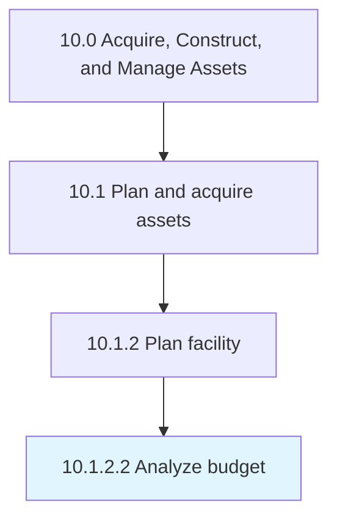

# Analyze budget

> Evaluating the feasibility of budgets prepared for the construction of facilities.

## Overview

Activity 10.1.2.2 is an activity within the Acquire, Construct, and Manage Assets framework. 

Evaluating the feasibility of budgets prepared for the construction of facilities.

## Process Hierarchy



## Key Statistics

| Metric | Value |
|--------|-------|
| APQC Code | 10959 |
| Hierarchy ID | 10.1.2.2 |
| Level | Activity |
| Parent | [10.1.2](../) |
| Sub-Processes | 0 |


## GraphDL Semantic Structure

```
analyze.Budget
```

| Component | Value | Description |
|-----------|-------|-------------|
| Verb | `analyze` | Primary action |
| Object | `budget` | Direct object |


## Related Concepts

- Budget


---

*Source: APQC PCF 10959 (10.1.2.2) - APQC*
