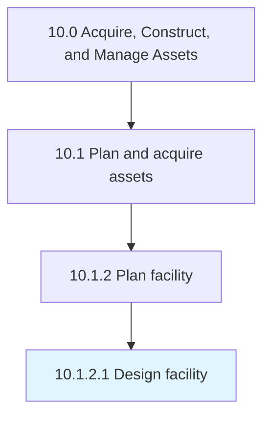

# Design facility

> Preparing and analyzing different designs for a facility in order to finalize which design will be the most suitable option.

## Overview

Activity 10.1.2.1 is an activity within the Acquire, Construct, and Manage Assets framework. 

Preparing and analyzing different designs for a facility in order to finalize which design will be the most suitable option.

## Process Hierarchy



## Key Statistics

| Metric | Value |
|--------|-------|
| APQC Code | 10958 |
| Hierarchy ID | 10.1.2.1 |
| Level | Activity |
| Parent | [10.1.2](../) |
| Sub-Processes | 0 |


## GraphDL Semantic Structure

```
design.Facility
```

| Component | Value | Description |
|-----------|-------|-------------|
| Verb | `design` | Primary action |
| Object | `facility` | Direct object |


## Related Concepts

- [Facility](/concepts/Facility)


---

*Source: APQC PCF 10958 (10.1.2.1) - APQC*
