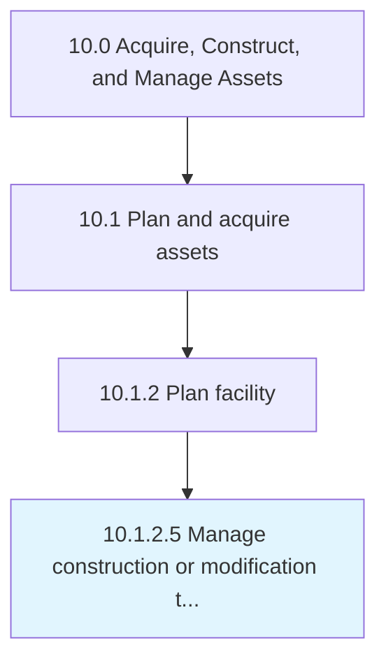

# Manage construction or modification to building

> Constructing the buildings.

## Overview

Activity 10.1.2.5 is an activity within the Acquire, Construct, and Manage Assets framework. 

Constructing the buildings. Manage renovations according to requirements and demands.

## Process Hierarchy



## Key Statistics

| Metric | Value |
|--------|-------|
| APQC Code | 10962 |
| Hierarchy ID | 10.1.2.5 |
| Level | Activity |
| Parent | [10.1.2](../) |
| Sub-Processes | 0 |


## GraphDL Semantic Structure

```
manage.ConstructionOrModification.to.Building
```

| Component | Value | Description |
|-----------|-------|-------------|
| Verb | `manage` | Primary action |
| Object | `construction or modification` | Direct object |
| Preposition | `to` | Relationship |
| PrepObject | `building` | Indirect object |


## Related Concepts

- [Construction](/concepts/Construction)
- [Building](/concepts/Building)
- [Modification](/concepts/Modification)
- [Building](/concepts/Building)


---

*Source: APQC PCF 10962 (10.1.2.5) - APQC*
