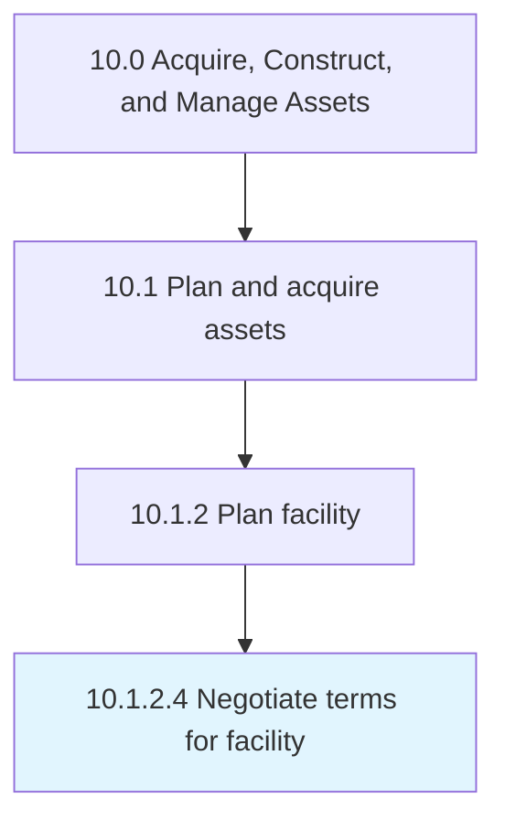

# Negotiate terms for facility

> Discussing the terms and conditions of facilities to be occupied according to the business requirements and availability of budgets.

## Overview

Activity 10.1.2.4 is an activity within the Acquire, Construct, and Manage Assets framework. 

Discussing the terms and conditions of facilities to be occupied according to the business requirements and availability of budgets.

## Process Hierarchy



## Key Statistics

| Metric | Value |
|--------|-------|
| APQC Code | 10961 |
| Hierarchy ID | 10.1.2.4 |
| Level | Activity |
| Parent | [10.1.2](../) |
| Sub-Processes | 0 |


## GraphDL Semantic Structure

```
negotiate.Terms.for.Facility
```

| Component | Value | Description |
|-----------|-------|-------------|
| Verb | `negotiate` | Primary action |
| Object | `terms` | Direct object |
| Preposition | `for` | Relationship |
| PrepObject | `facility` | Indirect object |


## Related Concepts

- [Terms](/concepts/Terms)
- [Facility](/concepts/Facility)


---

*Source: APQC PCF 10961 (10.1.2.4) - APQC*
