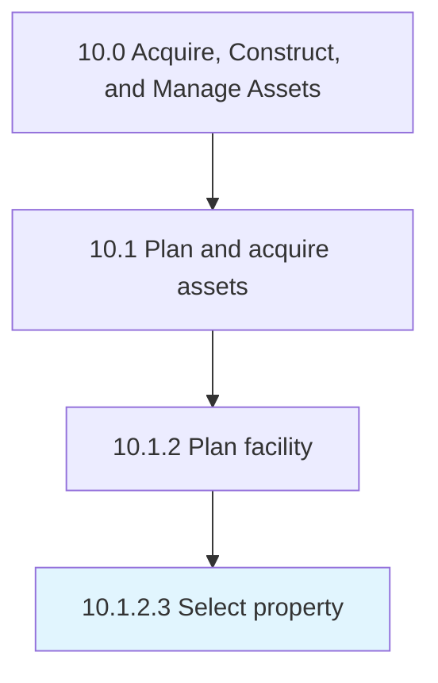

# Select property

> Assessing and choosing the appropriate property.

## Overview

Activity 10.1.2.3 is an activity within the Acquire, Construct, and Manage Assets framework. 

Assessing and choosing the appropriate property. Analyze the property requirements. Review the available property options. Finalize the most suitable option.

## Process Hierarchy



## Key Statistics

| Metric | Value |
|--------|-------|
| APQC Code | 10960 |
| Hierarchy ID | 10.1.2.3 |
| Level | Activity |
| Parent | [10.1.2](../) |
| Sub-Processes | 0 |


## GraphDL Semantic Structure

```
select.Property
```

| Component | Value | Description |
|-----------|-------|-------------|
| Verb | `select` | Primary action |
| Object | `property` | Direct object |


## Related Concepts

- Property


---

*Source: APQC PCF 10960 (10.1.2.3) - APQC*
