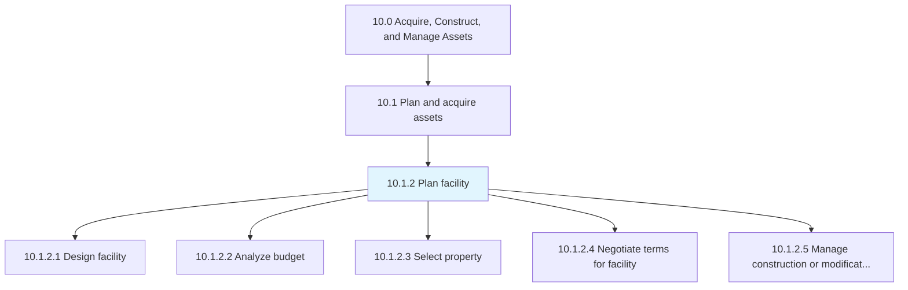
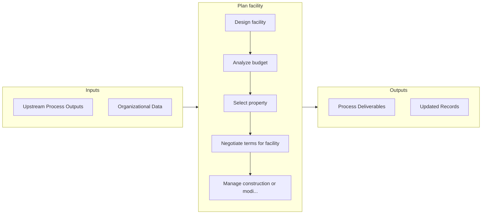

# Plan facility

> Recognizing the needs of facility users in order to construct a project proposal that meets those needs.

## Overview

Process 10.1.2 is a core process that defines the specific procedures for plan facility. 

Recognizing the needs of facility users in order to construct a project proposal that meets those needs.

## Process Hierarchy



## Key Statistics

| Metric | Value |
|--------|-------|
| APQC Code | 10943 |
| Hierarchy ID | 10.1.2 |
| Level | Process |
| Parent | [10.1](../) |
| Sub-Processes | 5 |


## GraphDL Semantic Structure

```graphdl
plan.Facility
```

| Component | Value | Description |
|-----------|-------|-------------|
| Verb | `plan` | Primary action |
| Object | `facility` | Direct object |


## Process Flow



## Sub-Processes

| Process | Hierarchy ID | Description |
|---------|-------------|-------------|
| [Design facility](./DesignFacility) | 10.1.2.1 | Preparing and analyzing different designs for a facility in order to finalize which design will be t |
| [Analyze budget](./AnalyzeBudget) | 10.1.2.2 | Evaluating the feasibility of budgets prepared for the construction of facilities |
| [Select property](./SelectProperty) | 10.1.2.3 | Assessing and choosing the appropriate property |
| [Negotiate terms for facility](./NegotiateTermsForFacility) | 10.1.2.4 | Discussing the terms and conditions of facilities to be occupied according to the business requireme |
| [Manage construction or modification to building](./ManageConstructionOrModificationToBuilding) | 10.1.2.5 | Constructing the buildings |


## Related Concepts

- Facility


---

*Source: APQC PCF 10943 (10.1.2) - APQC*
