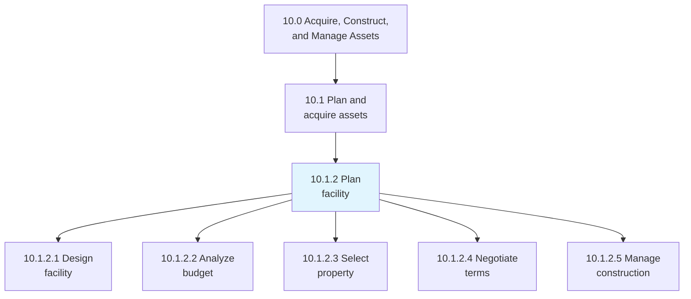
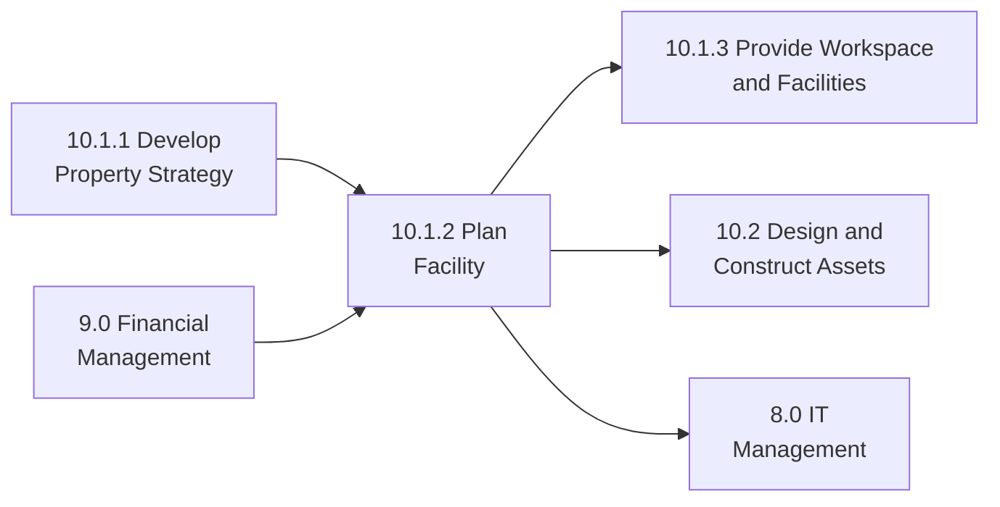

# Plan facility

> Recognizing the needs of facility users in order to construct a project proposal that meets those needs within budget and timeline constraints.

## Overview

Process 10.1.2 transforms property strategy into actionable facility plans. This includes designing facilities to meet user requirements, analyzing budget feasibility, selecting appropriate properties, negotiating favorable terms, and managing the construction or modification process.

Effective facility planning balances user needs, operational requirements, financial constraints, and timeline pressures. This process requires close collaboration between real estate, finance, operations, and end users to ensure facilities support business objectives and provide positive user experiences.

## Process Hierarchy



## Key Statistics

| Metric | Value |
|--------|-------|
| APQC Code | 10943 |
| Hierarchy ID | 10.1.2 |
| Level | Process |
| Parent | [10.1 Plan and acquire assets](../) |
| Category | [10.0 Acquire, Construct, and Manage Assets](../../) |
| Sub-Processes | 5 |

## Process Flow

```mermaid
flowchart TB
    subgraph Inputs["Inputs"]
        I1["Property Strategy"]
        I2["User Requirements"]
        I3["Budget Guidelines"]
        I4["Timeline Requirements"]
        I5["Regulatory Requirements"]
        I6["Available Properties"]
    end

    subgraph Design["10.1.2.1 Design Facility"]
        D1["Gather Requirements"]
        D2["Develop Concepts"]
        D3["Evaluate Options"]
        D4["Finalize Design"]
    end

    subgraph Budget["10.1.2.2 Analyze Budget"]
        B1["Estimate Costs"]
        B2["Assess Feasibility"]
        B3["Identify Trade-offs"]
        B4["Approve Budget"]
    end

    subgraph Select["10.1.2.3 Select Property"]
        S1["Evaluate Options"]
        S2["Site Due Diligence"]
        S3["Compare Alternatives"]
        S4["Recommend Selection"]
    end

    subgraph Negotiate["10.1.2.4 Negotiate Terms"]
        N1["Define Requirements"]
        N2["Negotiate Terms"]
        N3["Review Agreements"]
        N4["Execute Documents"]
    end

    subgraph Construct["10.1.2.5 Manage Construction"]
        C1["Oversee Work"]
        C2["Track Progress"]
        C3["Manage Changes"]
        C4["Commission Facility"]
    end

    subgraph Outputs["Outputs"]
        OUT1["Facility Design"]
        OUT2["Approved Budget"]
        OUT3["Executed Agreements"]
        OUT4["Completed Facility"]
    end

    Inputs --> Design
    Design --> Budget
    Budget --> Select
    Select --> Negotiate
    Negotiate --> Construct
    Construct --> Outputs
```



## GraphDL Semantic Structure

```graphdl
plan.Facility
```

| Component | Value | Description |
|-----------|-------|-------------|
| Verb | `plan` | Planning action |
| Object | `Facility` | Physical workspace |

### Decomposed Actions

| Activity | GraphDL Structure |
|----------|-------------------|
| 10.1.2.1 | `design.Facility` |
| 10.1.2.2 | `analyze.Budget` |
| 10.1.2.3 | `select.Property` |
| 10.1.2.4 | `negotiate.Terms.for.Facility` |
| 10.1.2.5 | `manage.Construction.or.Modification` |

## Sub-Processes

### [10.1.2.1 Design facility](./DesignFacility)

Preparing and analyzing different designs for a facility in order to finalize which design will be the most appropriate and effective.

**Key Activities:**
- Gather and document user requirements
- Develop conceptual design alternatives
- Evaluate designs against requirements
- Refine and finalize selected design

### [10.1.2.2 Analyze budget](./AnalyzeBudget)

Evaluating the feasibility of budgets prepared for the construction or acquisition of facilities.

**Key Activities:**
- Develop detailed cost estimates
- Assess budget feasibility
- Identify value engineering opportunities
- Obtain budget approval

### [10.1.2.3 Select property](./SelectProperty)

Assessing and choosing the appropriate property for the facility based on location, condition, cost, and fit.

**Key Activities:**
- Identify and evaluate property options
- Conduct site due diligence
- Compare alternatives
- Make selection recommendation

### [10.1.2.4 Negotiate terms for facility](./NegotiateTermsForFacility)

Discussing the terms and conditions of facilities to be occupied according to business requirements.

**Key Activities:**
- Define term requirements
- Negotiate lease or purchase terms
- Review legal agreements
- Execute final documents

### [10.1.2.5 Manage construction or modification to building](./ManageConstructionOrModificationToBuilding)

Constructing new buildings or modifying existing ones to meet facility requirements.

**Key Activities:**
- Oversee construction activities
- Track progress and milestones
- Manage change orders
- Commission completed facility

## RACI Matrix

| Activity | Responsible | Accountable | Consulted | Informed |
|----------|-------------|-------------|-----------|----------|
| Design Facility | Design Team | Facilities Manager | Users, IT, Safety | Finance, HR |
| Analyze Budget | Finance | CFO | Facilities, Procurement | Executive Team |
| Select Property | Real Estate | VP Real Estate | Facilities, Legal | Finance |
| Negotiate Terms | Real Estate | VP Real Estate | Legal, Finance | Executive Team |
| Manage Construction | Project Manager | VP Operations | Contractors, Engineering | All Stakeholders |

## Key Stakeholders

| Stakeholder | Role | Responsibilities |
|-------------|------|------------------|
| VP of Real Estate | Strategic Owner | Property decisions |
| Facilities Manager | Planning Lead | Design and requirements |
| Finance Manager | Budget Owner | Financial feasibility |
| User Representatives | Requirements | Functional needs |
| Legal Counsel | Contract Lead | Agreement review |
| Project Manager | Execution Lead | Construction oversight |

## Metrics and KPIs

| Metric | Description | Target |
|--------|-------------|--------|
| Design Approval Time | Time from requirements to design approval | <60 days |
| Budget Accuracy | Final cost vs. initial estimate | <10% variance |
| Selection Cycle Time | Time to select property | <90 days |
| Negotiation Success | Achieved vs. target terms | >90% of targets |
| Project Delivery | On-time completion | >95% |
| User Satisfaction | Post-occupancy satisfaction | >4.0/5.0 |

## Planning Considerations

### User Requirements
Engage users early and throughout the process to ensure facilities meet actual needs and expectations.

### Flexibility
Design for adaptability to accommodate future changes in use, technology, or organization.

### Sustainability
Incorporate energy efficiency, environmental certifications (LEED), and sustainable materials.

### Technology Integration
Plan for current and future technology requirements including power, data, and AV systems.

### Regulatory Compliance
Ensure designs meet building codes, accessibility requirements, and industry-specific regulations.

## Industry Variations

### Healthcare
Clinical workflow design, infection control, regulatory compliance, and specialized systems integration.

### Manufacturing
Production floor layout, material flow, equipment foundations, and utility infrastructure.

### Technology
Flexible workspace, high-density power/cooling, and collaboration-focused design.

### Retail
Customer experience design, merchandising requirements, and brand consistency.

## Related Processes



## Related Departments

- [Real Estate](/departments/Operations/RealEstate) - Property selection
- [Finance](/departments/Finance) - Budget analysis
- [Legal](/departments/Legal) - Contract negotiation
- [Information Technology](/departments/Technology) - Technology requirements
- [Human Resources](/departments/HumanResources) - Workforce needs

## Related Occupations

- [Facilities Managers](/occupations/Management/FacilitiesManagers) - Planning oversight
- [Architects](/occupations/Architecture/Architects) - Facility design
- [Property Managers](/occupations/Management/PropertyManagers) - Property selection
- [Construction Managers](/occupations/Management/ConstructionManagers) - Construction oversight
- [Interior Designers](/occupations/Arts/InteriorDesigners) - Space planning

## Related Concepts

- FacilityPlanning
- SpaceDesign
- SiteSelection
- LeaseNegotiation
- ConstructionManagement
- UserRequirements

---

*Source: APQC PCF 10943 (10.1.2) - Cross-Industry Process Classification Framework*
