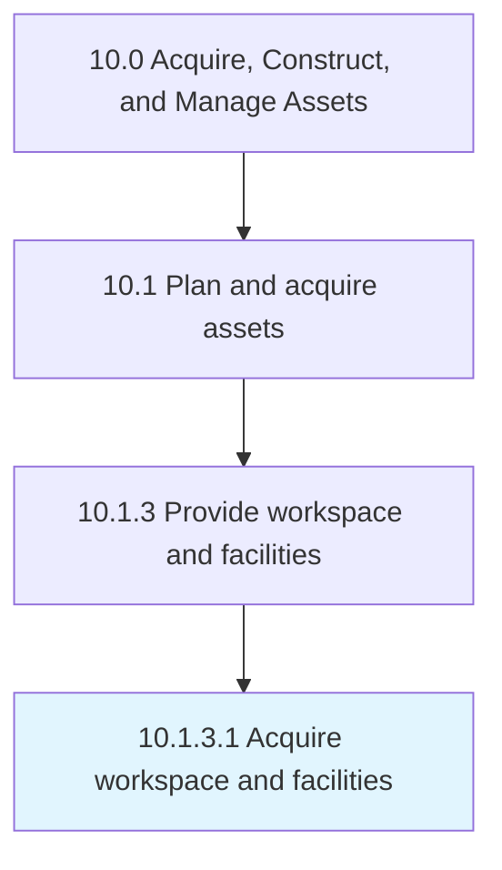

# Acquire workspace and facilities

> Attaining the office space with all assets (tables, chairs, computers, admin staff, etc.

## Overview

Activity 10.1.3.1 is an activity within the Acquire, Construct, and Manage Assets framework. 

Attaining the office space with all assets (tables, chairs, computers, admin staff, etc.) according to requirements.

## Process Hierarchy



## Key Statistics

| Metric | Value |
|--------|-------|
| APQC Code | 10963 |
| Hierarchy ID | 10.1.3.1 |
| Level | Activity |
| Parent | [10.1.3](../) |
| Sub-Processes | 0 |


## GraphDL Semantic Structure

```
acquire.WorkspaceAndFacilities
```

| Component | Value | Description |
|-----------|-------|-------------|
| Verb | `acquire` | Primary action |
| Object | `workspace and facilities` | Direct object |


## Related Concepts

- [Workspace](/concepts/Workspace)
- [Facilities](/concepts/Facilities)


---

*Source: APQC PCF 10963 (10.1.3.1) - APQC*
