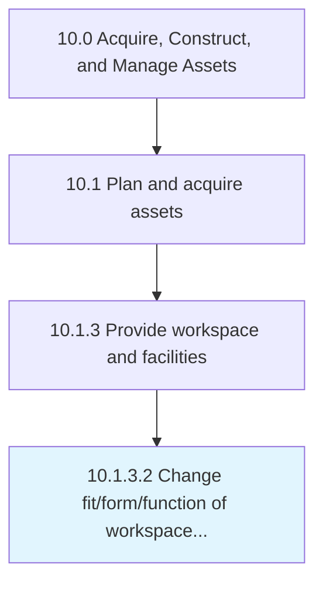

# Change fit/form/function of workspace and facilities

> Modifying the formation of the workspace and its assets.

## Overview

Activity 10.1.3.2 is an activity within the Acquire, Construct, and Manage Assets framework. 

Modifying the formation of the workspace and its assets. Make necessary changes in an office space with all assets (tables, chairs, computers, admin staff, interior designing, etc.) according to requirements.

## Process Hierarchy



## Key Statistics

| Metric | Value |
|--------|-------|
| APQC Code | 10964 |
| Hierarchy ID | 10.1.3.2 |
| Level | Activity |
| Parent | [10.1.3](../) |
| Sub-Processes | 0 |


## GraphDL Semantic Structure

```
change.Fitformfunction.of.WorkspaceAndFacilities
```

| Component | Value | Description |
|-----------|-------|-------------|
| Verb | `change` | Primary action |
| Object | `fit/form/function` | Direct object |
| Preposition | `of` | Relationship |
| PrepObject | `workspace and facilities` | Indirect object |


## Related Concepts

- [Fit](/concepts/Fit)
- [Workspace](/concepts/Workspace)
- [Fit](/concepts/Fit)
- [Facilities](/concepts/Facilities)
- [Form](/concepts/Form)
- [Workspace](/concepts/Workspace)
- [Form](/concepts/Form)
- [Facilities](/concepts/Facilities)
- [Function](/concepts/Function)
- [Workspace](/concepts/Workspace)


---

*Source: APQC PCF 10964 (10.1.3.2) - APQC*
