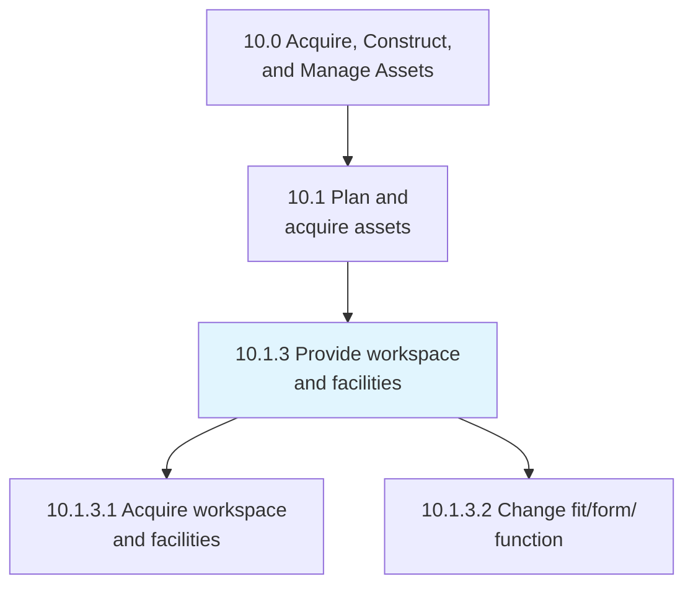
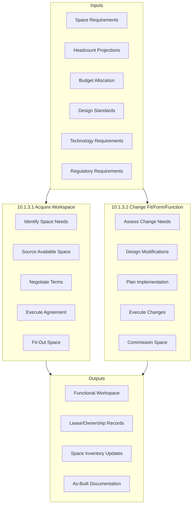
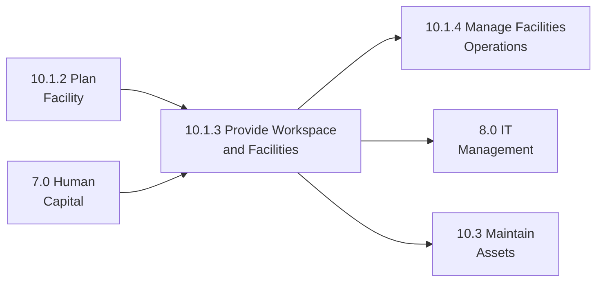

# Provide workspace and facilities

> Managing the provision of workspace and its assets, including acquiring office space and configuring it with furniture, equipment, and services to meet business requirements.

## Overview

Process 10.1.3 focuses on provisioning functional workspaces that support employee productivity and organizational needs. This includes acquiring appropriate spaces and equipping them with necessary furniture, technology, and amenities, as well as modifying existing spaces to meet changing requirements.

Effective workspace provisioning balances employee experience, operational requirements, and cost efficiency. Modern workspace strategies increasingly incorporate flexible work arrangements, collaboration spaces, and technology-enabled environments that adapt to changing work patterns.

## Process Hierarchy



## Key Statistics

| Metric | Value |
|--------|-------|
| APQC Code | 10944 |
| Hierarchy ID | 10.1.3 |
| Level | Process |
| Parent | [10.1 Plan and acquire assets](../) |
| Category | [10.0 Acquire, Construct, and Manage Assets](../../) |
| Sub-Processes | 2 |

## Process Flow



## GraphDL Semantic Structure

```graphdl
provide.Workspace.and.Facilities
```

| Component | Value | Description |
|-----------|-------|-------------|
| Verb | `provide` | Provisioning action |
| Object | `Workspace` | Work environments |
| Conjunction | `and` | Additional object |
| Object2 | `Facilities` | Supporting infrastructure |

### Decomposed Actions

| Activity | GraphDL Structure |
|----------|-------------------|
| 10.1.3.1 | `acquire.Workspace.and.Facilities` |
| 10.1.3.2 | `change.FitFormFunction.of.Workspace` |

## Sub-Processes

### [10.1.3.1 Acquire workspace and facilities](./AcquireWorkspaceAndFacilities)

Attaining office space with all assets including furniture, computers, and support services according to organizational requirements.

**Key Activities:**
- Define workspace requirements and specifications
- Source and evaluate available spaces
- Negotiate lease or purchase terms
- Execute real estate agreements
- Plan and execute fit-out and furnishing
- Commission and handover space

### [10.1.3.2 Change fit/form/function of workspace and facilities](./ChangeFitformfunctionOfWorkspaceAndFacilities)

Modifying the formation of workspace and its assets to accommodate changing business needs, work styles, or regulatory requirements.

**Key Activities:**
- Assess drivers for workspace changes
- Design modifications aligned with standards
- Develop implementation plan and timeline
- Execute construction or reconfiguration
- Install furniture and technology
- Commission modified space

## RACI Matrix

| Activity | Responsible | Accountable | Consulted | Informed |
|----------|-------------|-------------|-----------|----------|
| Acquire Workspace | Real Estate Team | VP Real Estate | Finance, Legal, HR | BU Leaders |
| Change Workspace | Facilities Team | Facilities Manager | IT, HR, Safety | Affected Employees |

## Key Stakeholders

| Stakeholder | Role | Responsibilities |
|-------------|------|------------------|
| VP of Real Estate | Strategic Owner | Portfolio strategy, major acquisitions |
| Facilities Manager | Operations Lead | Day-to-day provisioning |
| HR Business Partner | Workforce Planning | Headcount and space needs |
| IT Manager | Technology | Infrastructure requirements |
| Finance Manager | Budget | Capital and operating budgets |
| Interior Designer | Design | Space layout and aesthetics |

## Metrics and KPIs

| Metric | Description | Target |
|--------|-------------|--------|
| Space per Employee | Usable square feet per headcount | Industry benchmark |
| Provisioning Lead Time | Time from request to occupancy | <90 days |
| Fit-Out Cost | Cost per square foot of fit-out | Budget variance <10% |
| Occupancy Rate | Actual occupancy vs. capacity | >80% |
| Employee Satisfaction | Workspace satisfaction scores | >4.0/5.0 |
| Utilization Rate | Active use of provided spaces | >70% |

## Workspace Types

### Traditional Office
Dedicated workstations with fixed seating assignments. Suitable for roles requiring privacy or specialized equipment.

### Activity-Based Working
Variety of spaces designed for different work activities. Employees choose appropriate spaces based on tasks.

### Hot-Desking
Shared workstations without permanent assignments. Optimizes space utilization for mobile workforces.

### Collaboration Spaces
Meeting rooms, huddle rooms, and open collaboration areas supporting teamwork and interaction.

### Remote/Hybrid Support
Technology-enabled spaces supporting remote workers and hybrid meeting scenarios.

## Industry Variations

### Technology
Open floor plans, collaboration spaces, and amenities. Rapid scaling requires flexible workspace solutions.

### Financial Services
Trading floors, secure areas, and regulatory-compliant spaces. Traditional office layouts common.

### Manufacturing
Office space integrated with production facilities. Safety and clean room considerations.

### Healthcare
Clinical and administrative spaces with infection control, privacy, and accessibility requirements.

## Related Processes



## Related Departments

- [Human Resources](/departments/HumanResources) - Workforce planning
- [Information Technology](/departments/Technology) - Technology infrastructure
- [Finance](/departments/Finance) - Budget management
- [Legal](/departments/Legal) - Lease agreements
- [Procurement](/departments/Procurement) - Furniture and equipment

## Related Occupations

- [Facilities Managers](/occupations/Management/FacilitiesManagers) - Workspace management
- [Property Managers](/occupations/Management/PropertyManagers) - Real estate coordination
- [Interior Designers](/occupations/Arts/InteriorDesigners) - Space design
- [Administrative Services Managers](/occupations/Management/AdministrativeServicesManagers) - Office services

## Related Concepts

- WorkspaceStrategy
- SpaceProvisioning
- WorkplaceDesign
- RealEstateManagement
- FurnitureStandards
- TechnologyInfrastructure

---

*Source: APQC PCF 10944 (10.1.3) - Cross-Industry Process Classification Framework*
