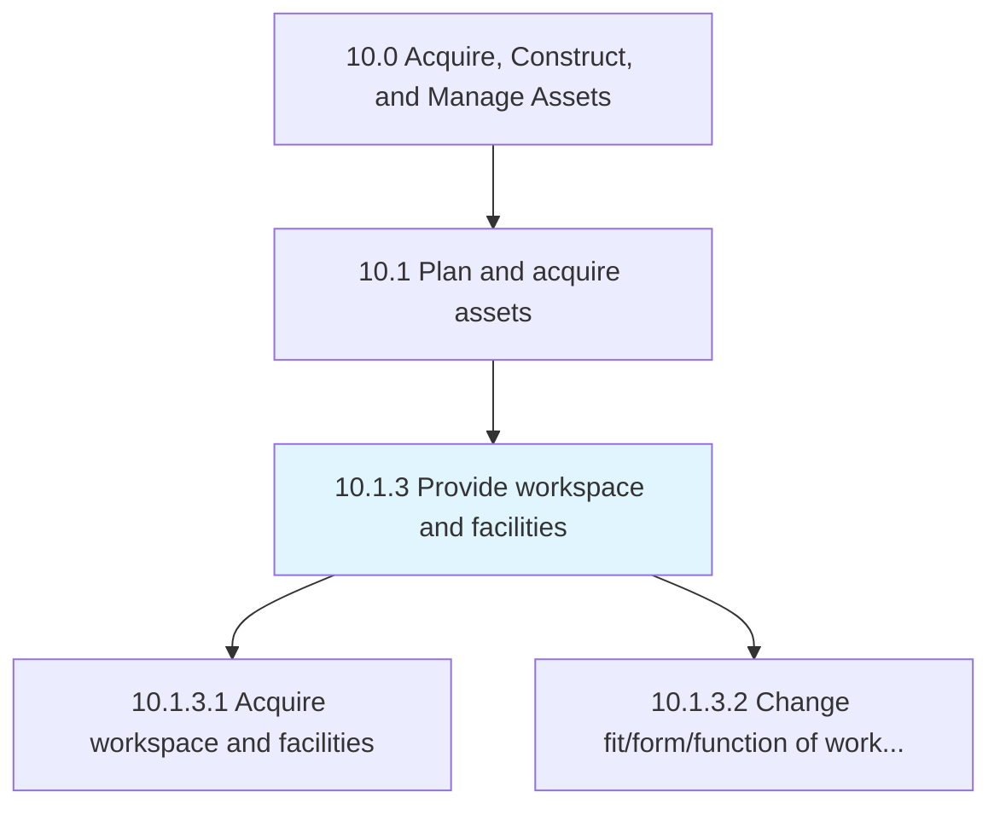
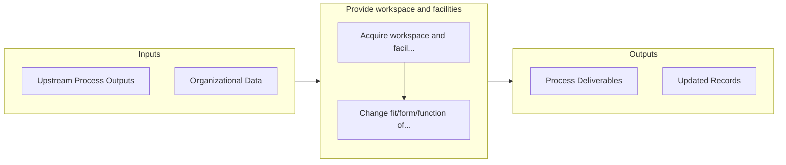

# Provide workspace and facilities

> Managing the provision of the workspace and its assets.

## Overview

Process 10.1.3 is a core process that defines the specific procedures for provide workspace and facilities. 

Managing the provision of the workspace and its assets. Arrange an office space with all assets (tables, chairs, computers, admin staff, etc.) according to requirements.

## Process Hierarchy



## Key Statistics

| Metric | Value |
|--------|-------|
| APQC Code | 10944 |
| Hierarchy ID | 10.1.3 |
| Level | Process |
| Parent | [10.1](../) |
| Sub-Processes | 2 |


## GraphDL Semantic Structure

```
provide.WorkspaceAndFacilities
```

| Component | Value | Description |
|-----------|-------|-------------|
| Verb | `provide` | Primary action |
| Object | `workspace and facilities` | Direct object |


## Process Flow



## Sub-Processes

| Process | Hierarchy ID | Description |
|---------|-------------|-------------|
| [Acquire workspace and facilities](./AcquireWorkspaceAndFacilities) | 10.1.3.1 | Attaining the office space with all assets (tables, chairs, computers, admin staff, etc |
| [Change fit/form/function of workspace and facilities](./ChangeFitformfunctionOfWorkspaceAndFacilities) | 10.1.3.2 | Modifying the formation of the workspace and its assets |


## Related Concepts

- Workspace
- Facilities


---

*Source: APQC PCF 10944 (10.1.3) - APQC*
