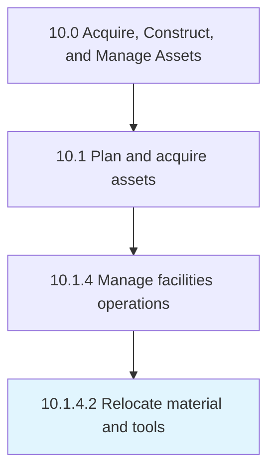

# Relocate material and tools

> Relocating the tools and raw materials.

## Overview

Activity 10.1.4.2 is an activity within the Acquire, Construct, and Manage Assets framework. 

Relocating the tools and raw materials. Shift raw or finished material and machines of company from one place to another place according to changes in business requirements.

## Process Hierarchy



## Key Statistics

| Metric | Value |
|--------|-------|
| APQC Code | 10966 |
| Hierarchy ID | 10.1.4.2 |
| Level | Activity |
| Parent | [10.1.4](../) |
| Sub-Processes | 0 |


## GraphDL Semantic Structure

```
relocate.MaterialAndTools
```

| Component | Value | Description |
|-----------|-------|-------------|
| Verb | `relocate` | Primary action |
| Object | `material and tools` | Direct object |


## Related Concepts

- Material
- Tools


---

*Source: APQC PCF 10966 (10.1.4.2) - APQC*
