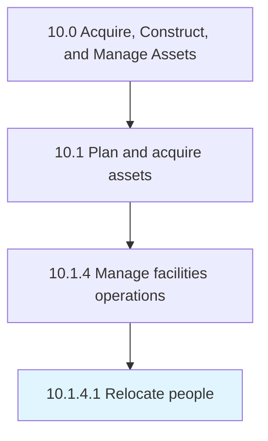

# Relocate people

> Shifting staff or employees from one place to another place according to changes in business requirements.

## Overview

Activity 10.1.4.1 is an activity within the Acquire, Construct, and Manage Assets framework. 

Shifting staff or employees from one place to another place according to changes in business requirements.

## Process Hierarchy



## Key Statistics

| Metric | Value |
|--------|-------|
| APQC Code | 10965 |
| Hierarchy ID | 10.1.4.1 |
| Level | Activity |
| Parent | [10.1.4](../) |
| Sub-Processes | 0 |


## GraphDL Semantic Structure

```
relocate.People
```

| Component | Value | Description |
|-----------|-------|-------------|
| Verb | `relocate` | Primary action |
| Object | `people` | Direct object |


## Related Concepts

- People


---

*Source: APQC PCF 10965 (10.1.4.1) - APQC*
