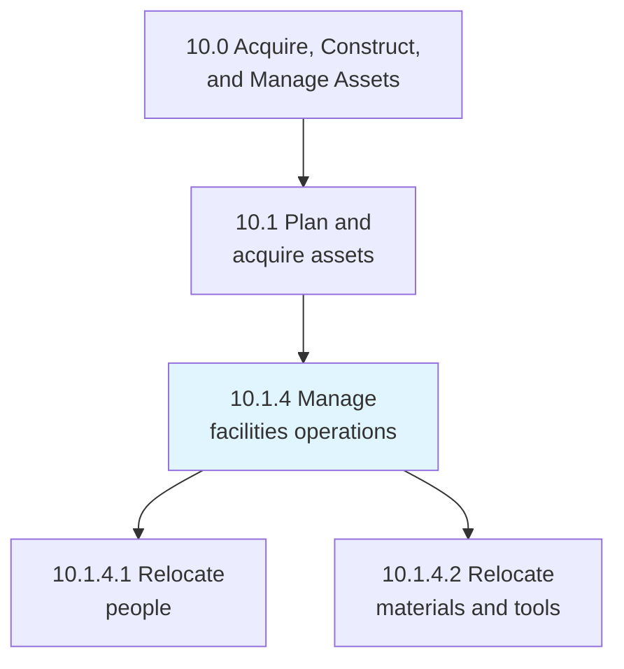
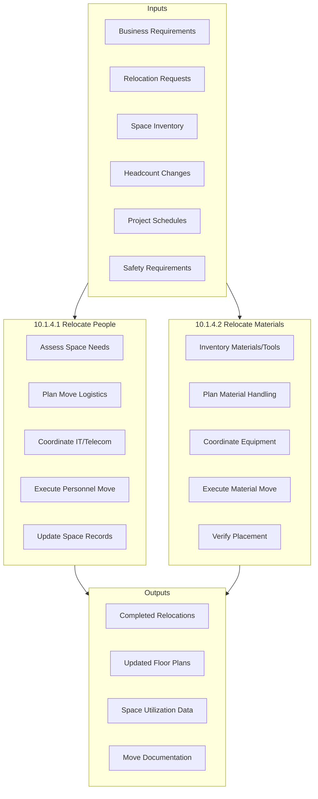
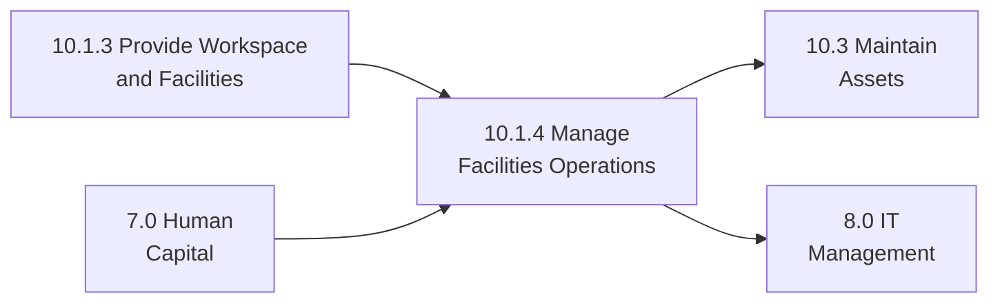

# Manage facilities operations

> Managing all operational activities of the facility including personnel relocations, material movements, and day-to-day facility services that support business unit operations.

## Overview

Process 10.1.4 encompasses the ongoing operational management of facilities after acquisition and setup. This includes managing how each function and business unit operates within the facility, coordinating relocations of personnel and materials, and ensuring facilities support organizational goals effectively.

Effective facilities operations management optimizes space utilization, minimizes operational disruptions, and ensures workplace environments support productivity and employee wellbeing. This process coordinates with HR for personnel moves, IT for technology transitions, and operations for material handling requirements.

## Process Hierarchy



## Key Statistics

| Metric | Value |
|--------|-------|
| APQC Code | 10949 |
| Hierarchy ID | 10.1.4 |
| Level | Process |
| Parent | [10.1 Plan and acquire assets](../) |
| Category | [10.0 Acquire, Construct, and Manage Assets](../../) |
| Sub-Processes | 2 |

## Process Flow



## GraphDL Semantic Structure

```graphdl
manage.FacilitiesOperations
```

| Component | Value | Description |
|-----------|-------|-------------|
| Verb | `manage` | Operational oversight action |
| Object | `FacilitiesOperations` | Day-to-day facility activities |

### Decomposed Actions

| Activity | GraphDL Structure |
|----------|-------------------|
| 10.1.4.1 | `relocate.People` |
| 10.1.4.2 | `relocate.Materials.and.Tools` |

## Sub-Processes

### [10.1.4.1 Relocate people](./RelocatePeople)

Shifting staff or employees from one place to another according to changes in business requirements. This includes office moves, department consolidations, and project-based relocations.

**Key Activities:**
- Assess current and required space allocation
- Plan move logistics and timeline
- Coordinate IT, telecom, and furniture requirements
- Communicate with affected personnel
- Execute move with minimal disruption
- Update space management systems

### [10.1.4.2 Relocate material and tools](./RelocateMaterialAndTools)

Relocating tools, equipment, and raw materials to support operational changes, facility reconfiguration, or production requirements.

**Key Activities:**
- Inventory materials and tools to be moved
- Assess special handling requirements
- Plan material handling and transport
- Coordinate with operations and safety
- Execute material relocation
- Verify proper placement and functionality

## RACI Matrix

| Activity | Responsible | Accountable | Consulted | Informed |
|----------|-------------|-------------|-----------|----------|
| Relocate People | Facilities Team | Facilities Manager | HR, IT, BU Managers | All Affected Staff |
| Relocate Materials | Facilities Team | Facilities Manager | Operations, Safety | Procurement, Finance |

## Key Stakeholders

| Stakeholder | Role | Responsibilities |
|-------------|------|------------------|
| Facilities Manager | Process Owner | Move planning and execution oversight |
| HR Business Partner | Coordination | Personnel communication and support |
| IT Manager | Infrastructure | Technology and connectivity |
| Operations Manager | Customer | Operational requirements |
| Safety Manager | Compliance | Safety during moves |
| Department Heads | Requestors | Move requirements and priorities |

## Metrics and KPIs

| Metric | Description | Target |
|--------|-------------|--------|
| Move Completion Rate | Moves completed on schedule | >95% |
| Downtime per Move | Employee/production downtime | <4 hours |
| Space Utilization | Occupied vs. available space | >85% |
| Move Cost Variance | Actual vs. budgeted cost | <10% |
| Employee Satisfaction | Post-move satisfaction scores | >4.0/5.0 |
| Safety Incidents | Injuries during moves | Zero |

## Industry Variations

### Manufacturing
Emphasis on production floor reconfigurations, equipment moves, and minimizing production disruption. Safety and heavy equipment handling are critical.

### Technology
Frequent moves due to rapid growth and project-based teams. Hot-desking and flexible workspace arrangements common.

### Healthcare
Clinical area relocations require infection control, equipment certification, and minimal patient impact.

### Financial Services
Trading floor and operations center moves require careful IT/telecom coordination and minimal service interruption.

## Related Processes



## Related Departments

- [Human Resources](/departments/HumanResources) - Personnel coordination
- [Information Technology](/departments/Technology) - IT infrastructure
- [Operations](/departments/Operations) - Operational requirements
- [Safety](/departments/Operations/Safety) - Move safety

## Related Occupations

- [Facilities Managers](/occupations/Management/FacilitiesManagers) - Move oversight
- [Administrative Services Managers](/occupations/Management/AdministrativeServicesManagers) - Office management
- [Movers](/occupations/Transportation/Movers) - Physical relocation
- [IT Support Specialists](/occupations/Computer/SupportSpecialists) - Technology setup

## Related Concepts

- SpaceManagement
- RelocationManagement
- WorkplaceServices
- ChangeManagement
- FacilityOperations

---

*Source: APQC PCF 10949 (10.1.4) - Cross-Industry Process Classification Framework*
