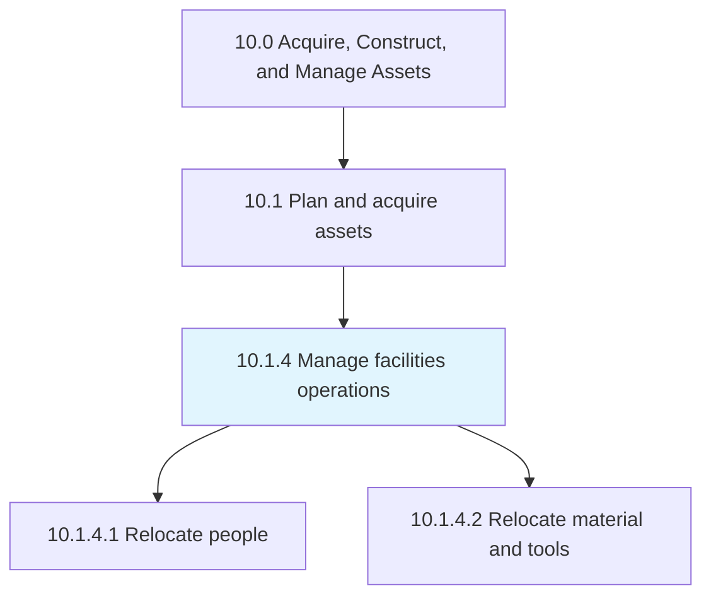
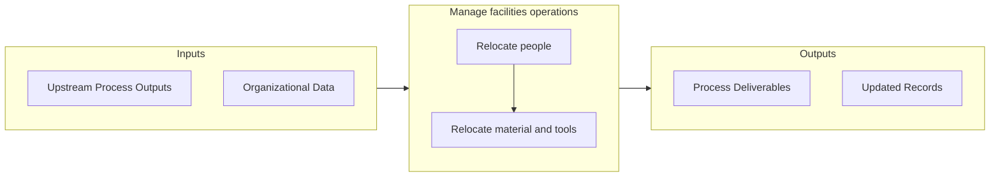

# Manage facilities operations

> Managing all operational activities of the facility.

## Overview

Process 10.1.4 is a core process that defines the specific procedures for manage facilities operations. 

Managing all operational activities of the facility. Manage how each function/business unit works. Support the manufacturing facility to attain organizational goals.

## Process Hierarchy



## Key Statistics

| Metric | Value |
|--------|-------|
| APQC Code | 10949 |
| Hierarchy ID | 10.1.4 |
| Level | Process |
| Parent | [10.1](../) |
| Sub-Processes | 2 |


## GraphDL Semantic Structure

```
manage.FacilitiesOperations
```

| Component | Value | Description |
|-----------|-------|-------------|
| Verb | `manage` | Primary action |
| Object | `facilities operations` | Direct object |


## Process Flow



## Sub-Processes

| Process | Hierarchy ID | Description |
|---------|-------------|-------------|
| [Relocate people](./RelocatePeople) | 10.1.4.1 | Shifting staff or employees from one place to another place according to changes in business require |
| [Relocate material and tools](./RelocateMaterialAndTools) | 10.1.4.2 | Relocating the tools and raw materials |


## Related Concepts

- [FacilitiesOperations](/concepts/FacilitiesOperations)


---

*Source: APQC PCF 10949 (10.1.4) - APQC*
