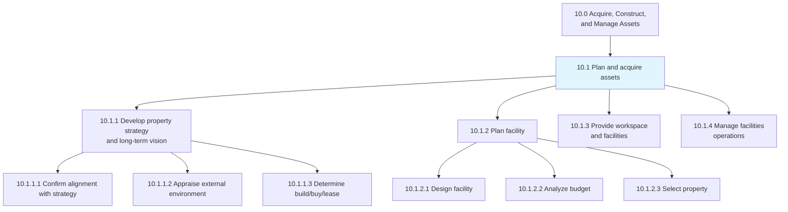
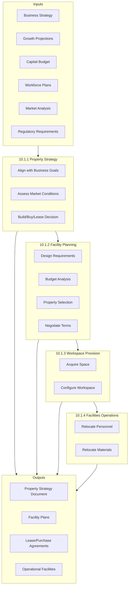
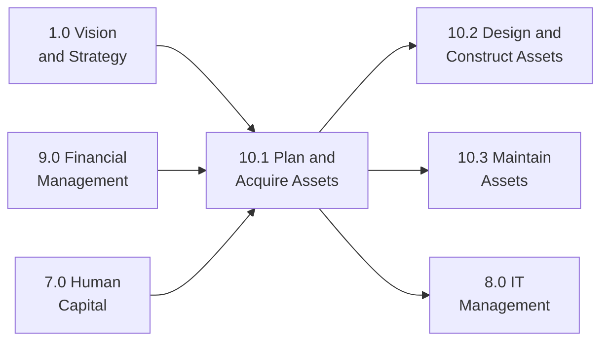

# Plan and acquire assets

> Planning, acquiring, and managing facilities, workspaces, and supporting assets. This process group establishes the strategic foundation for the organization's physical infrastructure and ensures alignment between property decisions and business objectives.

## Overview

Process Group 10.1 encompasses the strategic planning and acquisition activities that form the foundation of an organization's asset portfolio. This includes developing long-term property strategies, designing and planning facilities, provisioning workspaces, and managing ongoing facility operations.

Effective asset planning requires balancing organizational growth projections, financial constraints, workforce needs, and operational requirements. These processes ensure that facilities and workspaces support business objectives while optimizing capital deployment and operational efficiency.

## Process Hierarchy



## Key Statistics

| Metric | Value |
|--------|-------|
| APQC Code | 10937 |
| Hierarchy ID | 10.1 |
| Level | Process Group |
| Category | [10.0 Acquire, Construct, and Manage Assets](../) |
| Child Processes | 4 |
| Total Activities | 12 |

## Process Flow



## GraphDL Semantic Structure

```graphdl
plan.Assets
acquire.Assets
```

| Component | Value | Description |
|-----------|-------|-------------|
| Verb | `plan` | Strategic planning action |
| Verb | `acquire` | Procurement action |
| Object | `Assets` | Facilities, workspaces, equipment |

### Decomposed Actions

| Process | GraphDL Structure |
|---------|-------------------|
| 10.1.1 | `develop.PropertyStrategy.and.LongTermVision` |
| 10.1.2 | `plan.Facility` |
| 10.1.3 | `provide.Workspace.and.Facilities` |
| 10.1.4 | `manage.FacilitiesOperations` |

## Child Processes

### [10.1.1 Develop property strategy and long-term vision](./10.1.1-DevelopPropertyStrategyLong/)

Creating alignment between property requirements and business strategy while evaluating external market conditions to inform build, buy, or lease decisions.

**APQC Code:** 10941 | **Activities:** 3

Key activities include confirming alignment of property requirements with business strategy, appraising the external environment, and determining build/buy/lease decisions.

### [10.1.2 Plan facility](./10.1.2-PlanFacility/)

Recognizing the needs of facility users in order to construct a project proposal that meets those needs within budget constraints.

**APQC Code:** 10943 | **Activities:** 5

Key activities include designing facilities, analyzing budgets, selecting properties, negotiating terms, and managing construction or modifications.

### [10.1.3 Provide workspace and facilities](./10.1.3-ProvideWorkspaceFacilities/)

Managing the provision of workspace and its assets, including acquiring office space and configuring it with necessary equipment and furnishings.

**APQC Code:** 10944 | **Activities:** 2

Key activities include acquiring workspace and facilities, and changing the fit/form/function of workspaces.

### [10.1.4 Manage facilities operations](./10.1.4-ManageFacilitiesOperations/)

Managing all operational activities of the facility to support business units in achieving organizational goals.

**APQC Code:** 10949 | **Activities:** 2

Key activities include relocating people and relocating materials and tools.

## RACI Matrix

| Process | Responsible | Accountable | Consulted | Informed |
|---------|-------------|-------------|-----------|----------|
| 10.1.1 Property Strategy | Real Estate Team | CFO/COO | Strategy, Finance | Executive Team |
| 10.1.2 Facility Planning | Facilities Manager | VP Operations | Engineering, HR | All Departments |
| 10.1.3 Workspace Provision | Facilities Team | Facilities Manager | IT, HR, Safety | Affected BUs |
| 10.1.4 Facilities Operations | Operations Team | Facilities Manager | HR, Safety | All Employees |

## Key Stakeholders

| Stakeholder | Role | Responsibilities |
|-------------|------|------------------|
| Chief Financial Officer | Executive Sponsor | Capital allocation, investment approval |
| Chief Operating Officer | Process Owner | Strategic alignment, operational oversight |
| VP of Real Estate | Strategy Lead | Property portfolio management |
| Facilities Manager | Operations Lead | Day-to-day facility management |
| HR Leadership | Workforce Planning | Headcount projections, space requirements |
| IT Leadership | Infrastructure | Technology requirements, connectivity |
| Safety/Compliance | Regulatory | Code compliance, safety standards |

## Metrics and KPIs

| Metric | Description | Target |
|--------|-------------|--------|
| Space Utilization | Occupied space vs. available space | >85% |
| Cost per Square Foot | Total facility cost / usable space | Industry benchmark |
| Occupancy Cost Ratio | Facility costs / revenue | <8% |
| Project Delivery | Projects completed on time | >90% |
| Budget Variance | Actual vs. planned costs | <5% |
| Employee Satisfaction | Workspace satisfaction scores | >4.0/5.0 |
| Energy Efficiency | Energy use per square foot | Year-over-year improvement |

## Industry Variations

### Manufacturing
Focus on production floor optimization, equipment placement, and supply chain logistics. Facilities planning emphasizes material flow, safety zones, and expansion capacity.

### Technology
Emphasis on flexible workspace configurations, data center requirements, and collaborative spaces. Rapid growth often requires scalable lease arrangements.

### Healthcare
Regulatory compliance drives facility planning, including infection control, patient flow, and specialized equipment requirements. Long planning horizons for major capital projects.

### Retail
Location selection and customer accessibility are primary drivers. Facilities planning balances customer experience with operational efficiency.

## Related Processes



## Related Departments

- [Finance](/departments/Finance) - Capital budgeting and investment analysis
- [Operations](/departments/Operations) - Facility requirements and utilization
- [Human Resources](/departments/HumanResources) - Workforce planning and space needs
- [Legal](/departments/Legal) - Contract negotiation and compliance
- [Information Technology](/departments/Technology) - Infrastructure requirements

## Related Occupations

- [Facilities Managers](/occupations/Management/FacilitiesManagers) - Primary process ownership
- [Real Estate Managers](/occupations/Management/PropertyManagers) - Property strategy and acquisition
- [Financial Managers](/occupations/Management/FinancialManagers) - Capital planning and analysis
- [Industrial Engineers](/occupations/Architecture/IndustrialEngineers) - Space optimization
- [Construction Managers](/occupations/Management/ConstructionManagers) - Project execution

## Related Concepts

- PropertyStrategy
- FacilityPlanning
- WorkspaceManagement
- CapitalBudgeting
- LeaseManagement
- SpaceUtilization

---

*Source: APQC PCF 10937 (10.1) - Cross-Industry Process Classification Framework*
