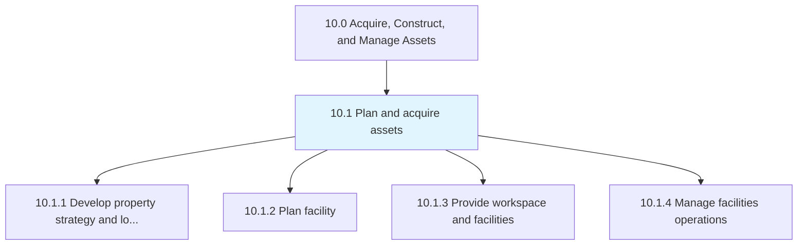
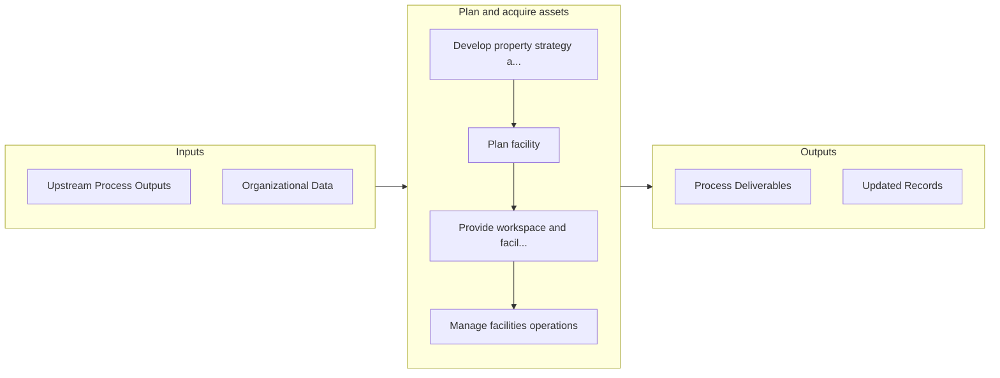

# Plan and acquire assets

> Planning, acquiring, and managing facilities, workspaces, and supporting assets.

## Overview

Group 10.1 is a process group within APQC Category 10.0 (Acquire, Construct, and Manage Assets). 

Planning, acquiring, and managing facilities, workspaces, and supporting assets. Acquire, configure, and manage facilities and workspaces, to include supporting equipment and materials.

## Process Hierarchy



## Key Statistics

| Metric | Value |
|--------|-------|
| APQC Code | 10937 |
| Hierarchy ID | 10.1 |
| Level | Group |
| Parent | [10](../) |
| Sub-Processes | 4 |


## GraphDL Semantic Structure

```
plan.AndAcquireAssets
```

| Component | Value | Description |
|-----------|-------|-------------|
| Verb | `plan` | Primary action |
| Object | `and acquire assets` | Direct object |


## Process Flow



## Sub-Processes

| Process | Hierarchy ID | Description |
|---------|-------------|-------------|
| [Develop property strategy and long term vision](./10.1.1-DevelopPropertyStrategyLong/) | 10.1.1 | Strategizing a long-term vision for managing properties |
| [Plan facility](./10.1.2-PlanFacility/) | 10.1.2 | Recognizing the needs of facility users in order to construct a project proposal that meets those ne |
| [Provide workspace and facilities](./10.1.3-ProvideWorkspaceFacilities/) | 10.1.3 | Managing the provision of the workspace and its assets |
| [Manage facilities operations](./10.1.4-ManageFacilitiesOperations/) | 10.1.4 | Managing all operational activities of the facility |


## Related Concepts

- Assets
- Assets


---

*Source: APQC PCF 10937 (10.1) - APQC*
