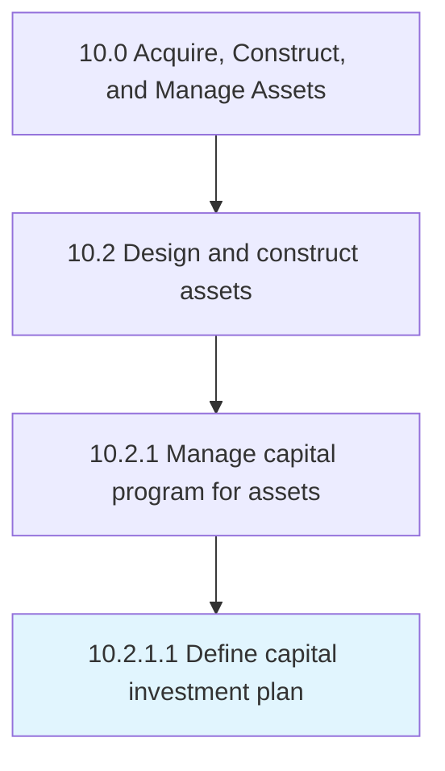

# Define capital investment plan

> Establishing what funds will be invested in the construction of productive assets for the advancement of established business objectives.

## Overview

Activity 10.2.1.1 is an activity within the Acquire, Construct, and Manage Assets framework. 

Establishing what funds will be invested in the construction of productive assets for the advancement of established business objectives.

## Process Hierarchy



## Key Statistics

| Metric | Value |
|--------|-------|
| APQC Code | 19210 |
| Hierarchy ID | 10.2.1.1 |
| Level | Activity |
| Parent | [10.2.1](../) |
| Sub-Processes | 0 |


## GraphDL Semantic Structure

```
define.CapitalInvestmentPlan
```

| Component | Value | Description |
|-----------|-------|-------------|
| Verb | `define` | Primary action |
| Object | `capital investment plan` | Direct object |


## Related Concepts

- CapitalInvestmentPlan


---

*Source: APQC PCF 19210 (10.2.1.1) - APQC*
