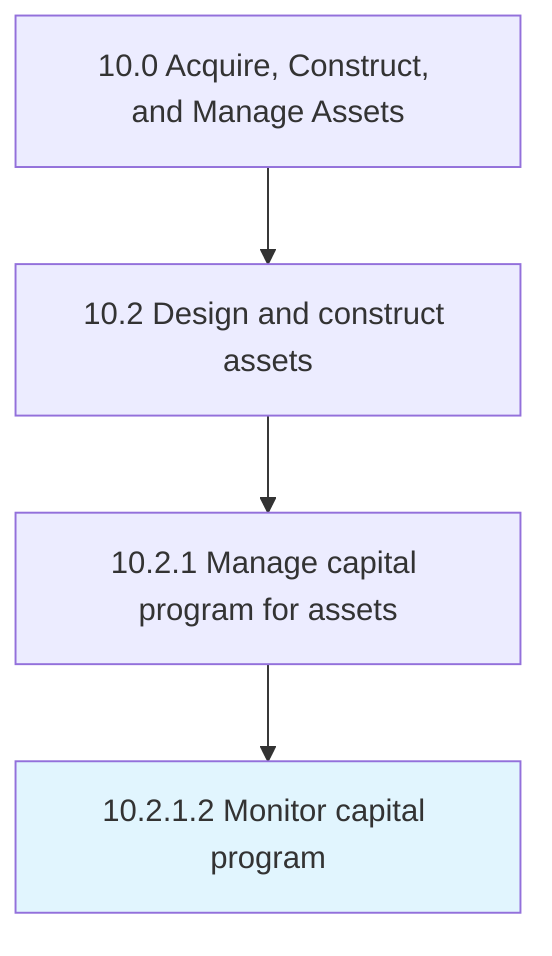

# Monitor capital program

> Monitoring plans on capital projects.

## Overview

Activity 10.2.1.2 is an activity within the Acquire, Construct, and Manage Assets framework. 

Monitoring plans on capital projects. Capital projects can be purchasing buildings, lands, etc.

## Process Hierarchy



## Key Statistics

| Metric | Value |
|--------|-------|
| APQC Code | 19211 |
| Hierarchy ID | 10.2.1.2 |
| Level | Activity |
| Parent | [10.2.1](../) |
| Sub-Processes | 0 |


## GraphDL Semantic Structure

```
monitor.CapitalProgram
```

| Component | Value | Description |
|-----------|-------|-------------|
| Verb | `monitor` | Primary action |
| Object | `capital program` | Direct object |


## Related Concepts

- CapitalProgram


---

*Source: APQC PCF 19211 (10.2.1.2) - APQC*
