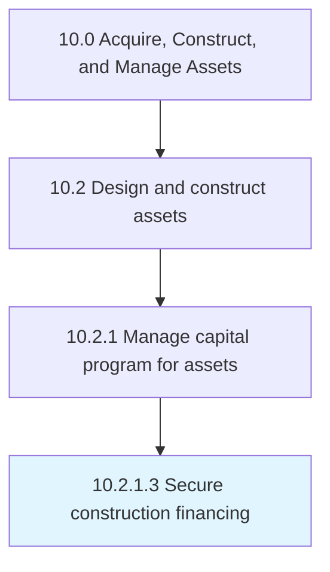

# Secure construction financing

> Acquiring the loans needed to construct necessary assets.

## Overview

Activity 10.2.1.3 is an activity within the Acquire, Construct, and Manage Assets framework. 

Acquiring the loans needed to construct necessary assets.

## Process Hierarchy



## Key Statistics

| Metric | Value |
|--------|-------|
| APQC Code | 19212 |
| Hierarchy ID | 10.2.1.3 |
| Level | Activity |
| Parent | [10.2.1](../) |
| Sub-Processes | 0 |


## GraphDL Semantic Structure

```
secure.ConstructionFinancing
```

| Component | Value | Description |
|-----------|-------|-------------|
| Verb | `secure` | Primary action |
| Object | `construction financing` | Direct object |


## Related Concepts

- [ConstructionFinancing](/concepts/ConstructionFinancing)


---

*Source: APQC PCF 19212 (10.2.1.3) - APQC*
