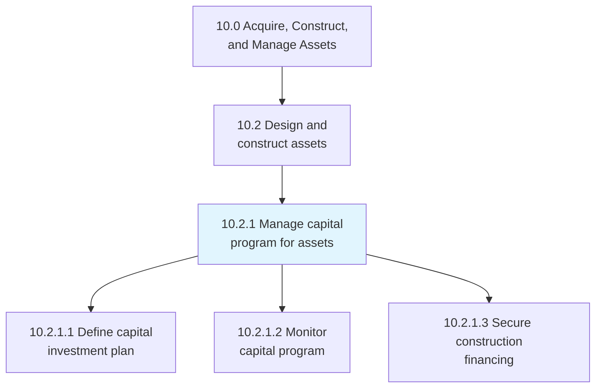
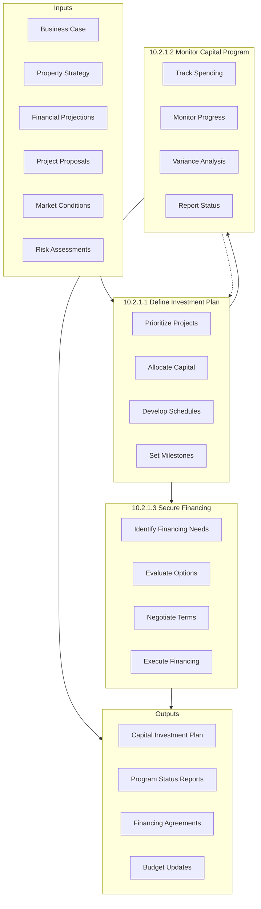
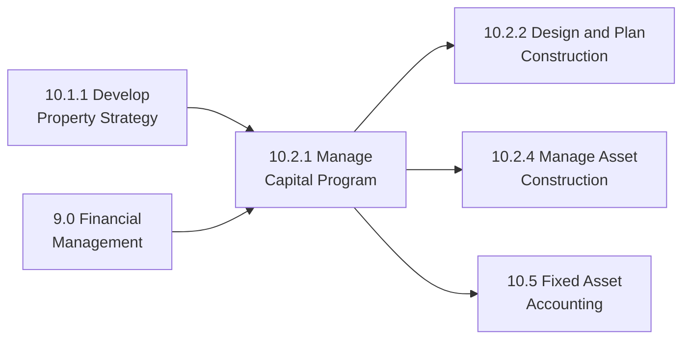

# Manage capital program for assets

> Producing and maintaining planning schedules and financial plans to purchase or manufacture productive assets. This process ensures capital investments are properly planned, funded, and monitored throughout execution.

## Overview

Process 10.2.1 establishes the financial and planning framework for asset construction and acquisition programs. This includes defining investment plans, monitoring capital deployment, and securing necessary financing. Effective capital program management ensures projects are properly funded, financially viable, and aligned with organizational priorities.

Capital programs often span multiple years and involve significant financial commitments. This process integrates with corporate financial planning, treasury management, and project governance to ensure capital investments deliver expected returns while managing financial risks.

## Process Hierarchy



## Key Statistics

| Metric | Value |
|--------|-------|
| APQC Code | 19209 |
| Hierarchy ID | 10.2.1 |
| Level | Process |
| Parent | [10.2 Design and construct assets](../) |
| Category | [10.0 Acquire, Construct, and Manage Assets](../../) |
| Sub-Processes | 3 |

## Process Flow



## GraphDL Semantic Structure

```graphdl
manage.CapitalProgram.for.Assets
```

| Component | Value | Description |
|-----------|-------|-------------|
| Verb | `manage` | Oversight and control action |
| Object | `CapitalProgram` | Investment program |
| Preposition | `for` | Purpose relationship |
| PrepObject | `Assets` | Target of investment |

### Decomposed Actions

| Activity | GraphDL Structure |
|----------|-------------------|
| 10.2.1.1 | `define.CapitalInvestmentPlan` |
| 10.2.1.2 | `monitor.CapitalProgram` |
| 10.2.1.3 | `secure.ConstructionFinancing` |

## Sub-Processes

### [10.2.1.1 Define capital investment plan](./DefineCapitalInvestmentPlan)

Establishing what funds will be invested in the construction of productive assets, including prioritization, allocation, and scheduling of capital expenditures.

**Key Activities:**
- Review and prioritize capital project proposals
- Allocate capital across approved projects
- Develop multi-year investment schedules
- Define funding milestones and gates
- Document capital investment plan

### [10.2.1.2 Monitor capital program](./MonitorCapitalProgram)

Monitoring plans on capital projects to ensure spending aligns with budgets and projects progress according to schedule.

**Key Activities:**
- Track capital spending against budget
- Monitor project progress and milestones
- Conduct variance analysis and forecasting
- Identify and escalate issues
- Report status to stakeholders

### [10.2.1.3 Secure construction financing](./SecureConstructionFinancing)

Acquiring the loans or other financing needed to construct necessary assets when internal capital is insufficient or external financing is more advantageous.

**Key Activities:**
- Identify financing needs and timing
- Evaluate financing options and sources
- Prepare financing proposals and documentation
- Negotiate terms and conditions
- Execute financing agreements

## RACI Matrix

| Activity | Responsible | Accountable | Consulted | Informed |
|----------|-------------|-------------|-----------|----------|
| Define Investment Plan | Finance Team | CFO | Operations, Strategy | Board, BU Leaders |
| Monitor Capital Program | Project Finance | CFO | Project Managers | Executive Team |
| Secure Financing | Treasury | CFO | Legal, Banks | Board, Auditors |

## Key Stakeholders

| Stakeholder | Role | Responsibilities |
|-------------|------|------------------|
| Chief Financial Officer | Executive Owner | Capital allocation, financing decisions |
| VP of Finance | Planning Lead | Investment planning and monitoring |
| Treasurer | Financing Lead | Financing strategy and execution |
| Project Directors | Capital Consumers | Project proposals and execution |
| Board of Directors | Governance | Major investment approval |
| Lenders/Investors | External | Financing provision |

## Metrics and KPIs

| Metric | Description | Target |
|--------|-------------|--------|
| Capital Deployment Rate | Capital deployed vs. planned | 90-100% |
| Budget Variance | Actual vs. budgeted capital spend | <5% |
| ROI Achievement | Projects achieving target returns | >80% |
| Financing Cost | Interest rate vs. benchmark | At or below market |
| Approval Cycle Time | Time from proposal to approval | <30 days |
| Program Completion Rate | Projects completed as planned | >90% |

## Capital Program Governance

### Approval Thresholds
Define approval authority levels based on project size, with larger investments requiring higher-level approval up to Board level.

### Stage-Gate Process
Implement stage-gate reviews at key milestones to validate continued investment and alignment with business case.

### Portfolio Management
Manage capital as a portfolio, balancing risk, return, and strategic alignment across all investments.

### Change Control
Establish formal process for scope, budget, or schedule changes requiring re-approval.

## Industry Variations

### Utilities
Large, long-duration capital programs with regulatory recovery mechanisms. Rate case planning integration critical.

### Manufacturing
Production capacity expansion with ROI-driven investment decisions. Technology upgrade cycles.

### Healthcare
Major facility expansions balanced with equipment replacement programs. Regulatory and certification requirements.

### Technology
Data center and infrastructure investments with rapid technology evolution considerations.

## Related Processes



## Related Departments

- [Finance](/departments/Finance) - Capital planning and monitoring
- [Treasury](/departments/Finance/Treasury) - Financing management
- [Strategy](/departments/Strategy) - Investment prioritization
- [Operations](/departments/Operations) - Project requirements

## Related Occupations

- [Financial Managers](/occupations/Management/FinancialManagers) - Capital management
- [Treasurers](/occupations/Business/Financial/Treasurers) - Financing strategy
- [Budget Analysts](/occupations/Business/Financial/BudgetAnalysts) - Budget monitoring
- [Financial Analysts](/occupations/Business/Financial/FinancialAnalysts) - Investment analysis
- [Project Management Specialists](/occupations/Business/Management/ProjectManagementSpecialists) - Program oversight

## Related Concepts

- CapitalBudgeting
- InvestmentPlanning
- ProjectFinancing
- PortfolioManagement
- StageGateProcess
- FinancialGovernance

---

*Source: APQC PCF 19209 (10.2.1) - Cross-Industry Process Classification Framework*
