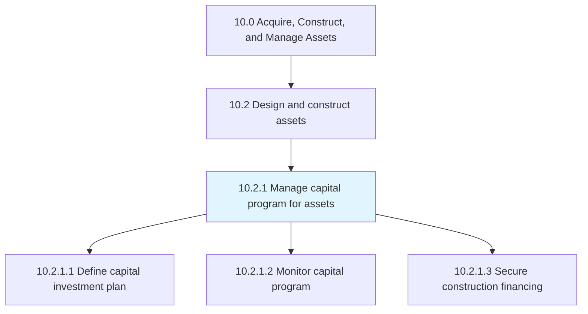
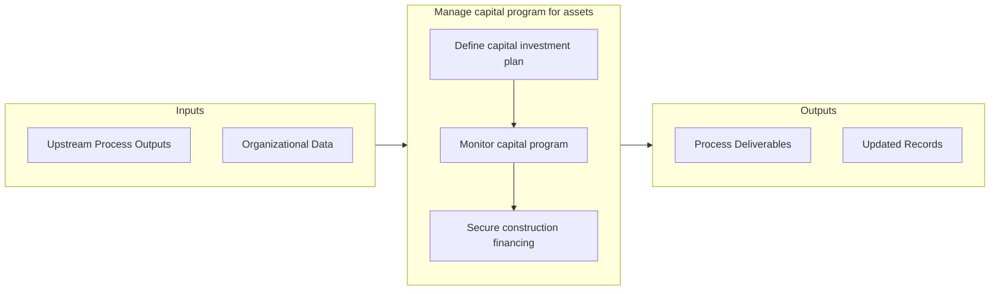

# Manage capital program for assets

> Producing and maintaining a planning schedule and a financial plan to purchase or manufacture productive assets.

## Overview

Process 10.2.1 is a core process that defines the specific procedures for manage capital program for assets. 

Producing and maintaining a planning schedule and a financial plan to purchase or manufacture productive assets. Determine the investment plan, monitor capital, and secure the necessary financing in order to realize completion of the program.

## Process Hierarchy



## Key Statistics

| Metric | Value |
|--------|-------|
| APQC Code | 19209 |
| Hierarchy ID | 10.2.1 |
| Level | Process |
| Parent | [10.2](../) |
| Sub-Processes | 3 |


## GraphDL Semantic Structure

```
manage.CapitalProgram.for.Assets
```

| Component | Value | Description |
|-----------|-------|-------------|
| Verb | `manage` | Primary action |
| Object | `capital program` | Direct object |
| Preposition | `for` | Relationship |
| PrepObject | `assets` | Indirect object |


## Process Flow



## Sub-Processes

| Process | Hierarchy ID | Description |
|---------|-------------|-------------|
| [Define capital investment plan](./DefineCapitalInvestmentPlan) | 10.2.1.1 | Establishing what funds will be invested in the construction of productive assets for the advancemen |
| [Monitor capital program](./MonitorCapitalProgram) | 10.2.1.2 | Monitoring plans on capital projects |
| [Secure construction financing](./SecureConstructionFinancing) | 10.2.1.3 | Acquiring the loans needed to construct necessary assets |


## Related Concepts

- [CapitalProgram](/concepts/CapitalProgram)
- [Assets](/concepts/Assets)


---

*Source: APQC PCF 19209 (10.2.1) - APQC*
