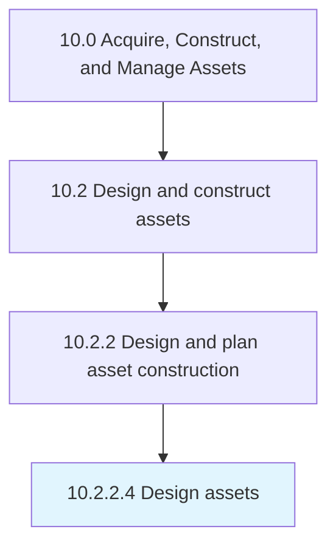

# Design assets

> Designing assets to meet organizational needs as well as ensuring that the asset adheres to all national, regional, and local construction codes.

## Overview

Activity 10.2.2.4 is an activity within the Acquire, Construct, and Manage Assets framework. 

Designing assets to meet organizational needs as well as ensuring that the asset adheres to all national, regional, and local construction codes.

## Process Hierarchy



## Key Statistics

| Metric | Value |
|--------|-------|
| APQC Code | 19222 |
| Hierarchy ID | 10.2.2.4 |
| Level | Activity |
| Parent | [10.2.2](../) |
| Sub-Processes | 0 |


## GraphDL Semantic Structure

```
design.Assets
```

| Component | Value | Description |
|-----------|-------|-------------|
| Verb | `design` | Primary action |
| Object | `assets` | Direct object |


## Related Concepts

- Assets


---

*Source: APQC PCF 19222 (10.2.2.4) - APQC*
