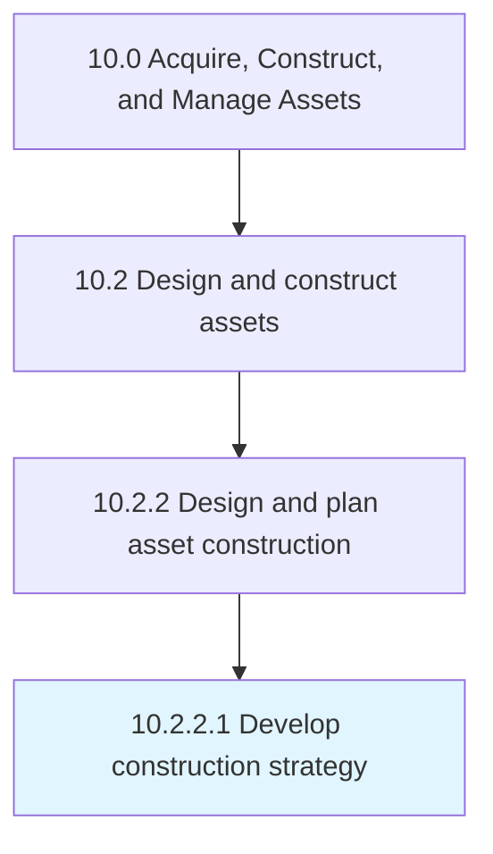

# Develop construction strategy

> Developing a strategy to perform asset construction.

## Overview

Activity 10.2.2.1 is an activity within the Acquire, Construct, and Manage Assets framework. 

Developing a strategy to perform asset construction. Assure that timelines, regulations, and resources are on task and on budget.

## Process Hierarchy



## Key Statistics

| Metric | Value |
|--------|-------|
| APQC Code | 19220 |
| Hierarchy ID | 10.2.2.1 |
| Level | Activity |
| Parent | [10.2.2](../) |
| Sub-Processes | 0 |


## GraphDL Semantic Structure

```
develop.ConstructionStrategy
```

| Component | Value | Description |
|-----------|-------|-------------|
| Verb | `develop` | Primary action |
| Object | `construction strategy` | Direct object |


## Related Concepts

- ConstructionStrategy


---

*Source: APQC PCF 19220 (10.2.2.1) - APQC*
